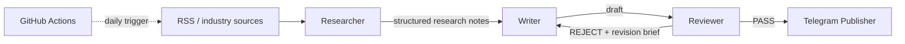

# Daily Chip News

[简体中文](README.md) | **English**

> An AI-assisted semiconductor intelligence workflow for business-facing roles. A small three-node micro-graph separates research, writing and review before deterministic publishing.

Daily Chip News started from a real information problem: semiconductor sales and solution-facing work requires continuous attention to foundries, chip vendors, memory markets, supply-chain changes and B2B hardware trends, while useful signals are scattered across multiple sources.

The workflow is intentionally small:

**Researcher → Writer → Reviewer → Publisher**

The Publisher is deterministic infrastructure rather than an agent node.

As of August 2026, the repository has accumulated **230+ scheduled GitHub Actions runs**, making it a long-running automation test bed rather than a one-off API demo.

## Workflow



Responsibilities are separated deliberately:

- **Researcher** retrieves and extracts evidence, judges business/technical relevance, and emits source-linked structured notes only.
- **Writer** starts from a fresh context containing only the editorial brief, approved Research Notes and, when needed, a Revision Brief.
- **Reviewer** evaluates grounding, relevance, clarity, recency, duplication, tone, length and formatting against an explicit rubric. It does not rewrite the copy itself.

Rejected drafts return to the Writer with a structured revision brief. The loop is bounded to two revisions by default; content that still fails review is held instead of being auto-published.

## Why a three-node micro-graph

The design focuses on three concerns:

1. **Evidence / copy separation** — raw browsing context is not passed into the writing stage.
2. **Clean-context writing** — every draft is generated from an intentionally limited input contract.
3. **Explicit QA gate** — Telegram publishing happens only after Reviewer PASS.

The goal is **context isolation + structured handoff + QA gate**, not a large multi-agent architecture.

## Data contracts

### Researcher output

```json
{
  "decision": "KEEP",
  "topic": "HBM supply",
  "source": "SemiEngineering",
  "url": "https://example.com/article",
  "published_at": "2026-08-24",
  "notes": [
    {
      "claim": "A fact supported by the source",
      "evidence": "Short evidence summary",
      "why_it_matters": "Business relevance",
      "confidence": 0.92
    }
  ]
}
```

### Writer output

```json
{
  "headline": "...",
  "summary": "...",
  "key_facts": ["...", "..."],
  "why_it_matters": "...",
  "telegram_copy": "..."
}
```

### Reviewer output

```json
{
  "status": "REJECT",
  "scores": {
    "factuality": 9,
    "relevance": 8,
    "clarity": 8
  },
  "issues": [
    {
      "severity": "major",
      "problem": "A conclusion is not supported by Research Notes"
    }
  ],
  "revision_brief": [
    "Remove the unsupported conclusion"
  ]
}
```

## Sources and topic scope

Default sources include EE Times, Semiconductor Engineering, ServeTheHome, TrendForce and selected high-signal Hacker News entries.

The editorial scope prioritizes foundry expansion, process-node progress, chip-vendor launches and earnings, memory and HBM, server hardware, supply-chain pricing or shortages, CXL, RISC-V and AI-infrastructure semiconductor developments.

Article pages are cleaned through Jina Reader before entering the Researcher node.

## Stack

| Layer | Tool |
| --- | --- |
| Source collection | RSS / `feedparser` |
| Content extraction | Jina Reader |
| AI nodes | Gemini API |
| Graph orchestration | Explicit Python micro-graph |
| Quality control | Reviewer rubric + bounded rewrite loop |
| Delivery | Telegram Bot API |
| Scheduling | GitHub Actions |
| Runtime | Python 3.11 |

## Repository structure

```text
.
├── .github/
│   └── workflows/
│       └── daily_news.yml
├── docs/
│   └── architecture.md
├── .env.example
├── .gitignore
├── main.py
├── requirements.txt
├── README.md          # Simplified Chinese / default
└── README.en.md       # English
```

## Run locally

```bash
pip install -r requirements.txt
```

Set environment variables:

```bash
GEMINI_API_KEY=...
GEMINI_MODEL=gemini-3.5-flash-lite
TELEGRAM_BOT_TOKEN=...
TELEGRAM_CHAT_ID=...
ARTICLES_PER_FEED=2
MAX_REVISIONS=2
```

Run:

```bash
python main.py
```

Do not commit real API keys or Telegram credentials.

## Automation

GitHub Actions runs the workflow once per day and also supports manual dispatch. Secrets are injected through GitHub Actions Secrets.

Runtime logs distinguish editorial outcomes (`SKIP`, `PASS`, `REJECT`, `HOLD`) from infrastructure failures such as Gemini, Jina or Telegram errors.

See [`docs/architecture.md`](docs/architecture.md) for the node contracts and state flow.
