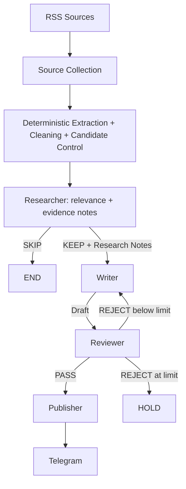

# Daily Chip News

[简体中文](README.md) | **English**

Daily Chip News is a daily automation workflow for semiconductor industry intelligence.

It collects recent items from several industry RSS feeds, uses deterministic code for extraction, cleaning and candidate control, and then sends each candidate through three focused AI nodes:

**Researcher → Writer → Reviewer → Telegram**

The Researcher reads the article body and produces structured research notes. The Writer turns those notes into concise Chinese coverage. The Reviewer checks factual support, relevance and writing quality against a fixed rubric. Approved content is delivered to Telegram by the deterministic Publisher. The repository has accumulated more than 230 scheduled GitHub Actions runs.

## Workflow



LangGraph `StateGraph` coordinates the three AI nodes while the deterministic Publisher handles delivery. A draft may be revised once by default (`MAX_REVISIONS=1`); another rejection moves the item to `HOLD`.

## The three AI nodes

### Researcher

The only AI node that reads the extracted article body. It judges relevance against the editorial scope (`KEEP`/`SKIP`) and emits Structured Research Notes: topic, source, URL, publication date, and 1-4 evidence-backed claims with confidence values.

### Writer

The first draft only receives Research Notes, the editorial brief and the output schema. It never sees raw article text, never fetches the web and must not add facts outside the notes. A revision only receives `research_notes`, `previous_draft` and `revision_brief`; it never re-calls the Researcher and cannot change the factual basis.

### Reviewer

The Reviewer only receives Research Notes, the Draft and the rubric, and never rewrites copy. `PASS` sends the item to the Publisher; `REJECT` returns a concise `revision_brief` that triggers exactly one Writer revision.

## Sources and candidate control

The daily candidate set currently comes from five feeds:

- [EE Times](https://www.eetimes.com/feed/)
- [Semiconductor Engineering](https://semiengineering.com/feed/)
- [ServeTheHome](https://www.servethehome.com/feed/)
- [TrendForce Semiconductors](https://www.trendforce.com/feed/Semiconductors.html)
- [Hacker News RSS](https://hnrss.org/newest?points=100)

Deterministic, zero-Gemini candidate control: URL/canonical dedupe → obvious junk removal (ads, hiring, nav pages, too-short titles) → round-robin source diversity with recency ordering inside each source → `MAX_CANDIDATES_PER_RUN=6`. After extraction, `clean_extracted_text()` removes reader metadata, image-only lines and repeated lines and truncates to `ARTICLE_CONTENT_CHARS=12000`. A single unavailable feed only affects that source; collection fails the run only when every source is down.

## Model routing

- `RESEARCHER_MODEL`: lightweight extraction model (currently `gemini-3.5-flash-lite`).
- `WRITER_MODEL`: Chinese writing quality (currently `gemini-3.6-flash`).
- `REVIEWER_MODEL`: fact checking and stable judgment (currently `gemini-3.7-flash`).

All three nodes run with `thinking=low` and output ceilings of 3072 / 2560 / 1024 tokens. Structured output (`responseSchema`) is kept, `candidateCount=1`, and no paid tools such as Search grounding are enabled.

## Cost governance (hard budget under the $10 credit)

Three layers of protection:

```text
application guard (primary, in code)
→ project spend cap (Owner sets ~$8 in AI Studio/Cloud)
→ $10/month promotional credit
```

Code-level budgets:

| Variable | Default | Purpose |
| --- | --- | --- |
| `SCHEDULED_RUN_BUDGET_USD` | `0.20` | Paid ceiling for one scheduled run |
| `MANUAL_RUN_BUDGET_USD` | `0.05` | Manual `workflow_dispatch` ceiling, code hard max `0.10` |
| `GEMINI_ROLLING_30D_BUDGET_USD` | `7.50` | Rolling 30-day ceiling no run may exceed |

- 31 fully spent days ≈ $6.20, leaving ≈ $1.30 for price drift, manual runs and billing lag.
- **Cost protection outranks finishing every candidate**: when the budget is short the run stops; it never raises the budget or switches models to finish the job.

### Pre-flight before every billable call (fail closed)

1. `countTokens` returns the exact input tokens for the equivalent request; any failure refuses the call.
2. Price lookup: unknown model or expired pricing refuses the call.
3. Worst-case projection: `input × 1.05 × input price + max_output_tokens × output price` (thinking tokens are billed as output).
4. Check `run_spend + projected ≤ run_budget` and `rolling_30d_spend + projected ≤ 7.50`; if either fails the request is never sent, never retried and never downgraded to a different model.

### Billing and ledger

- Every successful 200 response is billed separately from `usageMetadata` (`prompt` + `candidates` + `thoughts`); each successful retry counts on its own and a JSON repair is its own billable request.
- Each attempt first writes a worst-case reservation and later reconciles to the actual cost; ambiguous timeouts keep their reservation instead of assuming a free call.
- The rolling 30-day ledger is JSONL persisted across runs through a GitHub Actions artifact (`retention-days: 45`, single-instance concurrency). Each run first commits a run_open reservation for its whole budget and settles it to the actual spend at the end, so a crashed run can never undercount.
- A corrupt, missing (`COST_LEDGER_REQUIRED=1`) or unreadable ledger fails closed: no paid generation.

## Run outcome state machine

| Outcome | Condition | exit code |
| --- | --- | --- |
| `SUCCESS` | Completed normally, `published > 0`, no failures | 0 |
| `PARTIAL_SUCCESS` | `published > 0`, but article failures / breaker open / time budget exhausted | 0 |
| `EMPTY_SUCCESS` | No candidates, or all candidates filtered (`SKIP`/`HOLD`) | 0 |
| `COST_GUARD_STOPPED` | Budget protection stopped the run | 0 |
| `FAILED` | `published == 0` with failures/service unavailability, or a program fault | 1 |

Key semantics: once an article is published, later Gemini failures never redefine the run as FAILED; a cost-guard stop is an expected operational state that stays green and never pollutes the Gemini health window; a genuine zero-publish outage is never disguised as success.

## Error taxonomy and breaker

```text
TRANSIENT_RATE_LIMIT / TRANSIENT_SERVER / TRANSIENT_NETWORK   service-level, counted by the breaker
MODEL_RESPONSE_INVALID / MODEL_RESPONSE_TRUNCATED / SCHEMA_INVALID   article-level
SOURCE_ERROR / PUBLISH_ERROR / CONFIG_ERROR / COST_GUARD / UNEXPECTED_ERROR
```

Rolling-window breaker: among the last `GEMINI_HEALTH_WINDOW(5)` AI logical calls, `GEMINI_HEALTH_THRESHOLD(3)` transient failures mean the service is unavailable. Granularity is fixed at **one logical call = one event** (success and failure share the same granularity); `SchemaError`/`GeminiResponseError` occupy slots without counting as transient and without erasing history; `COST_GUARD` never enters the window.

Retries: 429 honours `Retry-After` first (capped at 120 s); 5xx/network/timeout use exponential backoff 2s→4s→8s→16s with jitter; one logical call is capped by `GEMINI_CALL_BUDGET_SECONDS=240`, the run by `RUN_BUDGET_SECONDS=2100`, and HTTP timeouts are clamped to the remaining budget.

## Installation and configuration

```bash
python -m venv .venv
.venv\Scripts\activate
python -m pip install -r requirements.txt
```

Copy `.env.example` to `.env` and fill it in:

```env
GEMINI_API_KEY=your_gemini_api_key
RESEARCHER_MODEL=your_researcher_model
WRITER_MODEL=your_writer_model
REVIEWER_MODEL=your_reviewer_model
TELEGRAM_BOT_TOKEN=your_telegram_bot_token
TELEGRAM_CHAT_ID=your_telegram_chat_id
ARTICLES_PER_FEED=2
MAX_REVISIONS=1
```

Git ignores `.env`; the Gemini key travels in the `x-goog-api-key` header. GitHub Actions reads credentials from Repository Secrets and model names from Repository Variables.

## GitHub Actions

Runs daily at 06:55 Asia/Shanghai (`55 22 * * *` UTC) and supports `workflow_dispatch`. The job uses `timeout-minutes: 60` and `concurrency.cancel-in-progress: false` so only one run touches the ledger.

Manual inputs:

- `paid_budget_usd`: paid ceiling for this manual run, default `0.05`, code hard max `0.10`.
- `ledger_anchor_usd`: recovery only, for re-anchoring spend after a lost ledger.

Pipeline: `Prepare cost ledger` (read the previous artifact, write the run_open reservation) → `python main.py` → `Upload cost ledger` (`if: always()`, so failures and crashes still persist spend).

## Run locally

```bash
python main.py
```

Local runs default to `RUN_MODE=manual` and skip ledger writes unless `COST_LEDGER_PATH` is set.

## Calls per article

```text
typical (KEEP → PASS): Researcher 1 + Writer 1 + Reviewer 1 = 3
one revision:          + Writer 1 + Reviewer 1               = 5
SKIP:                  Researcher only                       = 1
JSON repair:           +1 only when the output is invalid (billed separately)
```

## Tests

```bash
python -m compileall .
python -m unittest discover -s tests
```

## Project structure

```text
.
├─ src/daily_chip_news/
│  ├─ app.py          # batch orchestration, outcome, summary, ledger wiring
│  ├─ config.py       # environment settings, budget parsing, editorial constants
│  ├─ cost.py         # pricing table and token cost math
│  ├─ cost_guard.py   # pre-flight / reservation / reconcile
│  ├─ errors.py       # failure taxonomy and routing flags
│  ├─ gemini.py       # Gemini client: retry/timeout/countTokens/structured JSON
│  ├─ graph.py        # LangGraph StateGraph
│  ├─ health.py       # rolling-window service health
│  ├─ ledger.py       # rolling 30-day cost ledger and artifact reader
│  ├─ metrics.py      # run counters and token/cost accumulation
│  ├─ outcomes.py     # outcome state machine and exit codes
│  ├─ publisher.py
│  ├─ schemas.py
│  ├─ sources.py      # RSS collection, extraction, cleaning, candidate control
│  └─ nodes/
│     ├─ researcher.py
│     ├─ writer.py
│     └─ reviewer.py
├─ scripts/ledger_prepare.py
├─ tests/
├─ docs/architecture.md
├─ .github/workflows/daily_news.yml
├─ .env.example
├─ main.py
└─ requirements.txt
```

See [`docs/architecture.md`](docs/architecture.md) for state, data contracts and the cost lifecycle.
