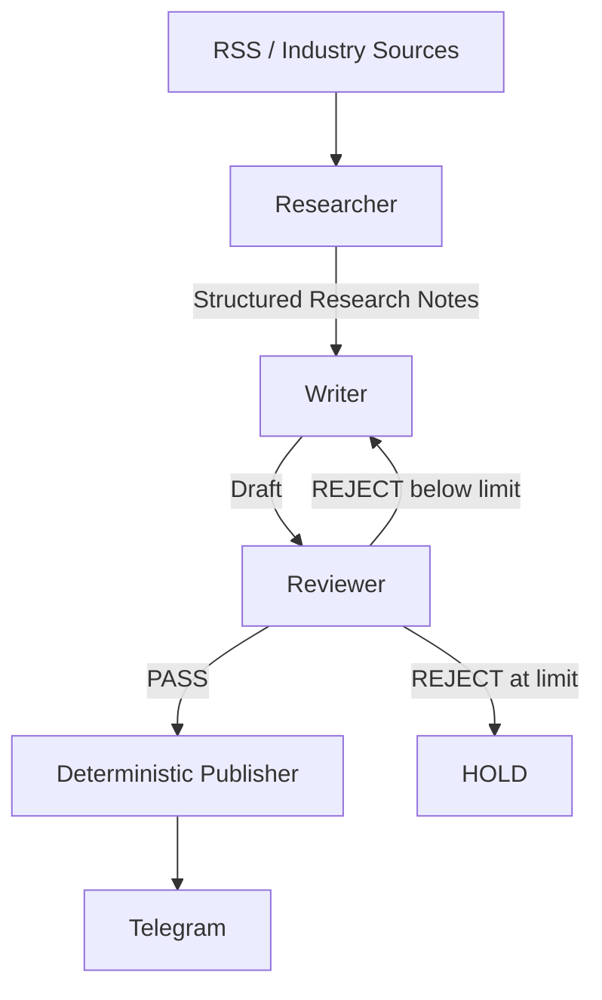

# Daily Chip News

[简体中文](README.md) | **English**

Daily Chip News is an AI content-production workflow for semiconductor sales, AI presales, solution, and applied-AI roles. It does more than ask a model to summarize RSS items: it turns distributed industry sources into evidence-backed Chinese intelligence that is reviewed before publication.

The codebase has been upgraded to the V2 Micro-Graph. The repository history contains **230+ scheduled GitHub Actions runs**; that number describes the full project history and does not imply that every run used V2. V2 still needs its first live validation after a new Gemini Free Tier API key and model variables are configured.

## Workflow



V2 uses a minimal LangGraph `StateGraph`. It has exactly three AI agent nodes:

- **Researcher** retrieves candidate article text, determines relevance, extracts evidence, and emits Structured Research Notes only.
- **Writer** starts with a fresh context on every call and sees only the Editorial Brief, Research Notes, optional Revision Brief, and output schema.
- **Reviewer** is a QA gate driven by an explicit rubric. It returns `PASS` / `REJECT`, scores, issues, and a concise revision brief; it never rewrites the article.

The Publisher is deterministic infrastructure, not a fourth agent. Telegram is called only after Reviewer `PASS`; `SKIP`, `REJECT`, `HOLD`, and infrastructure failures never publish.

## Why this design

A single large prompt mixes retrieval, inference, writing, and self-review. V2 keeps the workflow explainable through three boundaries:

1. **Context isolation**: raw article text stops at the Researcher. The Writer never receives source text, RSS history, or the Researcher prompt.
2. **Structured handoff**: nodes exchange only machine-readable Research Notes, Draft, Review, and Revision Brief objects.
3. **QA gate with bounded revision**: a rejection sends only the original Research Notes and concise correction requests back to the Writer. Two revisions are allowed by default; another rejection results in `HOLD`.

The project demonstrates “identify the scenario → design the workflow → build the PoC → run QA” without a database, Redis, vector store, RAG, MCP, Celery, supervisor agent, or unnecessary persistence.

## Data contracts

Example Researcher KEEP output:

```json
{
  "decision": "KEEP",
  "reason": "Relevant to HBM supply",
  "topic": "HBM supply",
  "source": "Example Source",
  "url": "https://example.com/article",
  "published_at": "2026-08-24",
  "notes": [
    {
      "claim": "A fact supported by the source",
      "evidence": "Concise evidence summary",
      "why_it_matters": "Commercial or technical relevance",
      "confidence": 0.9
    }
  ]
}
```

Writer output:

```json
{
  "headline": "...",
  "summary": "...",
  "key_facts": ["..."],
  "why_it_matters": "...",
  "telegram_copy": "..."
}
```

Reviewer output:

```json
{
  "status": "REJECT",
  "scores": {"factuality": 9, "relevance": 8, "clarity": 9},
  "issues": [{"severity": "major", "problem": "A claim lacks source support"}],
  "revision_brief": ["Remove the unsupported conclusion"]
}
```

The review rubric covers factual grounding, source support, unsupported claims, commercial relevance, recency, clarity, duplication, tone, length, and format.

## Independent model routing

Each node reads its own model setting instead of sharing one global model:

- `RESEARCHER_MODEL`: prioritize low cost, high throughput, extraction, and structured output.
- `WRITER_MODEL`: prioritize language-generation quality.
- `REVIEWER_MODEL`: prioritize fact checking, instruction following, and stable judgment.

The repository does not assume that any specific Gemini model is currently available. After creating the API key, choose models that are actually available to that account. The three values may be the same, but the code allows them to be genuinely different.

## Secret boundary

The repository stores variable names and safe placeholders only. Real credentials belong in a local `.env` / system environment or GitHub Repository Secrets. The Gemini client uses the `x-goog-api-key` header instead of a query string. Errors and logs do not print API keys, Telegram tokens, credential-bearing URLs, or the full environment.

GitHub configuration:

- Repository Secret: `GEMINI_API_KEY`
- Repository Secrets: `TELEGRAM_BOT_TOKEN`, `TELEGRAM_CHAT_ID`
- Repository Variables: `RESEARCHER_MODEL`, `WRITER_MODEL`, `REVIEWER_MODEL`

## Run locally

```bash
python -m pip install -r requirements.txt
```

Copy `.env.example` to `.env` and provide local values:

```env
GEMINI_API_KEY=your_gemini_api_key
RESEARCHER_MODEL=your_researcher_model
WRITER_MODEL=your_writer_model
REVIEWER_MODEL=your_reviewer_model
TELEGRAM_BOT_TOKEN=your_telegram_bot_token
TELEGRAM_CHAT_ID=your_telegram_chat_id
ARTICLES_PER_FEED=2
MAX_REVISIONS=2
```

Then run:

```bash
python main.py
```

Missing secrets or model variables produce a clear configuration error without exposing values. Gemini authentication, quota, unavailable-model, network, and JSON failures propagate instead of becoming business `SKIP` decisions. A final Telegram delivery failure also fails the task.

## Tests and repository structure

Static and mock validation does not require a real Gemini key:

```bash
python -m compileall .
python -m unittest discover -s tests
```

```text
.
├─ src/daily_chip_news/
│  ├─ config.py
│  ├─ gemini.py
│  ├─ schemas.py
│  ├─ sources.py
│  ├─ graph.py
│  ├─ publisher.py
│  ├─ app.py
│  └─ nodes/
│     ├─ researcher.py
│     ├─ writer.py
│     └─ reviewer.py
├─ tests/
├─ docs/architecture.md
├─ .github/workflows/daily_news.yml
├─ .env.example
├─ main.py
└─ requirements.txt
```

See [`docs/architecture.md`](docs/architecture.md) for state, routing, context, and failure semantics.
