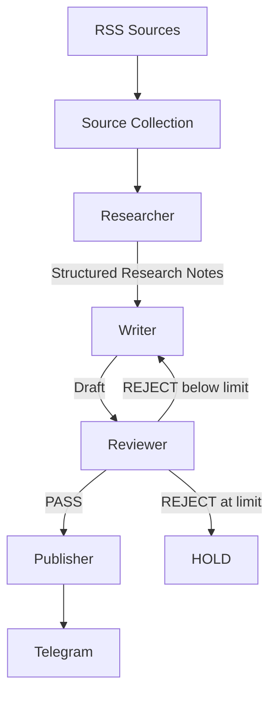

# Daily Chip News

[简体中文](README.md) | **English**

Daily Chip News is a daily automation workflow for semiconductor industry intelligence.

It collects recent items from several industry RSS feeds, extracts the article text, and sends each candidate through three focused AI nodes:

**Researcher → Writer → Reviewer → Telegram**

The Researcher extracts useful facts and supporting evidence. The Writer turns structured research notes into concise Chinese coverage. The Reviewer checks factual support, relevance, and writing quality against a fixed rubric. Approved content is delivered to Telegram by the Publisher. The repository has accumulated more than 230 scheduled GitHub Actions runs.

## Workflow



LangGraph `StateGraph` coordinates the three AI nodes, while the deterministic Publisher handles delivery. A draft may be revised twice by default; another rejection moves the item to `HOLD`.

## The three nodes

### Researcher

The Researcher retrieves the candidate article, evaluates it against the editorial scope, and produces Structured Research Notes. Notes include the topic, source, URL, publication date, and evidence-backed claims with confidence values. Semantically irrelevant items return `SKIP`.

### Writer

Each Writer call receives only the Editorial Brief, Structured Research Notes, output schema, and an optional Revision Brief. Raw article text stays within the Researcher call, and node handoffs remain structured.

The Writer returns a headline, summary, key facts, why-it-matters section, and Telegram copy in concise, factual Chinese.

### Reviewer

The Reviewer applies a fixed rubric covering factual grounding, source support, unsupported claims, commercial relevance, recency, clarity, duplication, tone, length, and format.

It returns `PASS` or `REJECT`. Rejections include scores, issues, and a concise Revision Brief for the Writer to apply to the original Research Notes.

## Sources

The daily candidate set currently comes from five feeds:

- [EE Times](https://www.eetimes.com/feed/)
- [Semiconductor Engineering](https://semiengineering.com/feed/)
- [ServeTheHome](https://www.servethehome.com/feed/)
- [TrendForce Semiconductors](https://www.trendforce.com/feed/Semiconductors.html)
- [Hacker News RSS](https://hnrss.org/newest?points=100)

Candidate URLs are deduplicated before Jina Reader extracts the article text. If one RSS source is unavailable, the run records its source and error type and continues with the healthy feeds. Collection becomes a run-level failure only when every configured source is unavailable.

## Model routing

Each AI node has its own model setting:

- `RESEARCHER_MODEL`: suited to high-throughput extraction and structured output.
- `WRITER_MODEL`: selected for Chinese writing quality.
- `REVIEWER_MODEL`: selected for fact checking, instruction following, and stable judgment.

Choose model names from those currently available to the Gemini account. The three settings may use the same model or different models.

## Installation and configuration

Python 3.11 is recommended:

```bash
python -m venv .venv
.venv\Scripts\activate
python -m pip install -r requirements.txt
```

Copy `.env.example` to `.env` and provide local settings:

```env
GEMINI_API_KEY=your_gemini_api_key
RESEARCHER_MODEL=your_researcher_model
WRITER_MODEL=your_writer_model
REVIEWER_MODEL=your_reviewer_model
TELEGRAM_BOT_TOKEN=your_telegram_bot_token
TELEGRAM_CHAT_ID=your_telegram_chat_id
ARTICLES_PER_FEED=2
MAX_REVISIONS=2
```

Git ignores `.env`. The Gemini API key is sent in the `x-goog-api-key` header. GitHub Actions reads credentials from Repository Secrets and model names from Repository Variables.

## Run locally

```bash
python main.py
```

For a smaller local smoke test, override the candidate count only for the current process:

```powershell
$env:ARTICLES_PER_FEED = "1"
python main.py
```

## GitHub Actions

`.github/workflows/daily_news.yml` targets 06:55 every day in `Asia/Shanghai` (UTC+08:00), represented as `55 22 * * *` in GitHub's UTC cron, and also supports manual `workflow_dispatch` runs. GitHub does not guarantee an exact start time for scheduled workflows.

Configure these Repository Secrets:

- `GEMINI_API_KEY`
- `TELEGRAM_BOT_TOKEN`
- `TELEGRAM_CHAT_ID`

And these Repository Variables:

- `RESEARCHER_MODEL`
- `WRITER_MODEL`
- `REVIEWER_MODEL`

## Failure isolation

Failures are isolated at both source and article level:

```text
Source A → OK
Source B → FAILED → record and continue
Source C → OK

Article A → PASS   → publish
Article B → FAILED → record and continue
Article C → SKIP   → continue
Article D → PASS   → publish
```

Article extraction, structured JSON, schema validation, and an isolated transient request failure affect only the current item. Sustained Gemini unavailability is inferred when any two consecutive articles fail with network, 429, or 5xx errors in the Researcher, Writer, or Reviewer node after bounded retries; the count spans those three AI stages and resets after a successful article or a non-AI failure. Gemini authentication, permission, or model-configuration errors, Telegram authentication or target configuration errors, complete RSS collection failure, and a run with `published == 0 && failed > 0` remain run-level failures. Each run-level failure makes a best-effort operational alert through the deterministic Telegram Publisher without calling Gemini.

Every run ends with one summary:

```text
Run summary:
  sources_total: ...
  sources_ok: ...
  sources_failed: ...
  candidates: ...
  processed: ...
  published: ...
  skipped: ...
  held: ...
  failed: ...
  revisions: ...
  workflow_status: PASS or FAIL
```

Source and article failure records contain only the source URL or name, article title, processing stage, error type, and (when available) a safe HTTP status code; provider error messages are not printed.

## Tests

Unit tests use fake and mock clients, so they do not require live Gemini or Telegram credentials:

```bash
python -m compileall .
python -m unittest discover -s tests
```

## Project structure

```text
.
├─ src/daily_chip_news/
│  ├─ app.py
│  ├─ config.py
│  ├─ gemini.py
│  ├─ graph.py
│  ├─ publisher.py
│  ├─ schemas.py
│  ├─ sources.py
│  └─ nodes/
│     ├─ researcher.py
│     ├─ writer.py
│     └─ reviewer.py
├─ tests/
├─ docs/architecture.md
├─ .github/workflows/daily_news.yml
├─ .env.example
├─ main.py
└─ requirements.txt
```

See [`docs/architecture.md`](docs/architecture.md) for state, data contracts, context boundaries, and failure routing.
