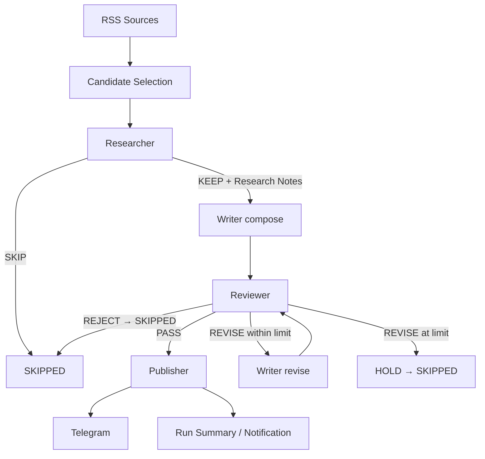

# Daily Chip News

[简体中文](README.md) | **English**

Daily Chip News is a daily semiconductor-industry intelligence pipeline.

It ingests multiple industry RSS feeds, uses deterministic code for article extraction, cleaning and candidate control, and then runs three single-responsibility AI nodes:

**Sources → Candidate Selection → Researcher → Writer → Reviewer → Publisher → Run Summary**

The Researcher reads the article body and emits structured research notes; the Writer drafts Chinese copy from those notes only; the Reviewer applies a fixed rubric; the deterministic Publisher sends approved items to Telegram; the run ends with a summary and, when needed, an operational alert.

## Pipeline



A LangGraph `StateGraph` wires the three AI nodes while the Publisher stays deterministic. One revision is allowed by default (`MAX_REVISIONS=1`); when the limit is reached the item ends as `HOLD` (counted as SKIPPED).

## The three AI nodes

### Researcher

The only AI node that reads the article body (capped at `ARTICLE_CONTENT_CHARS=12000`). It judges relevance against the editorial scope (`KEEP`/`SKIP`) and emits structured research notes: topic, source, URL, date, companies / products / models / events, key numbers and time points, information gaps, plus 1-4 evidence-backed notes with confidence. Research notes are the factual baseline for writing and review.

### Writer

Compose reads Research Notes + editorial brief + output schema only: no article body, no web access, no facts beyond the notes. Revise additionally receives `previous_draft` and `revision_brief`, still from the same Research Notes, without calling the Researcher again.

### Reviewer

Reads Research Notes + Draft + rubric and never rewrites, focusing on factual consistency, company / product / model / number accuracy, unsupported extrapolation, structure and publishable quality:

- `PASS`: publishable, handed to the Publisher.
- `REVISE`: fixable by editing the draft; must return explicit `revision_brief` instructions and triggers one Writer revision.
- `REJECT`: not fixable by rewriting; the candidate ends as `SKIPPED`.

## Sources and candidate control

Five default sources (override with `SOURCE_FEEDS`):

- [EE Times](https://www.eetimes.com/feed/)
- [Semiconductor Engineering](https://semiengineering.com/feed/)
- [ServeTheHome](https://www.servethehome.com/feed/)
- [TrendForce Semiconductors](https://www.trendforce.com/feed/Semiconductors.html)
- [Hacker News RSS](https://hnrss.org/newest?points=100)

Candidate selection is fully deterministic (zero model calls):

```text
RSS ingestion → normalize → canonical URL → dedupe → garbage filtering
→ recency filtering (MAX_CANDIDATE_AGE_HOURS) → source round-robin
→ MAX_CANDIDATES_PER_RUN (default 6)
```

Every candidate is a structured object: `id` / `title` / `url` / `source` / `published_at` / `metadata`. After extraction, `clean_extracted_text()` strips reader metadata, image lines and duplicates and truncates at `ARTICLE_CONTENT_CHARS`. A single unavailable feed only affects that source; when every source is unavailable the run is `FAILED`.

## Gemini client and model routing

All AI nodes share one Gemini client (`gemini.py`): API key from configuration, request serialization, response parsing, timeouts, retries, HTTP error mapping and JSON repair. Each node has its own model and generation profile:

| Node | Variable | Default thinking | Default output limit |
| --- | --- | --- | --- |
| Researcher | `RESEARCHER_MODEL` | `low` | 3072 |
| Writer | `WRITER_MODEL` | `low` | 2560 |
| Reviewer | `REVIEWER_MODEL` | `low` | 1024 |

Structured output keeps `responseSchema` (`GEMINI_STRUCTURED_OUTPUT=1`) and no paid tools such as Search grounding are used. All settings live in `config.py`: local runs read `.env`, GitHub Actions reads Secrets / Variables.

## Reliability

```text
TRANSIENT_RATE_LIMIT / TRANSIENT_SERVER / TRANSIENT_NETWORK   service level, counts toward the breaker
MODEL_RESPONSE_INVALID / MODEL_RESPONSE_TRUNCATED / SCHEMA_INVALID   candidate level
SOURCE_ERROR / PUBLISH_ERROR / CONFIG_ERROR / UNEXPECTED_ERROR
```

- **retry**: 429 honours `Retry-After` (capped at 120s); 5xx / network / timeout back off exponentially 2s→4s→8s→16s with jitter; one logical call is bounded by `GEMINI_CALL_BUDGET_SECONDS=240`, one run by `RUN_BUDGET_SECONDS=2100`, and the HTTP timeout is clamped to the remaining budget.
- **breaker**: when transient failures among the last `BREAKER_WINDOW(5)` AI logical calls reach `BREAKER_THRESHOLD(3)`, the run stops AI processing for the remaining candidates. Granularity is exactly one event per logical call; `SchemaError`/`GeminiResponseError` occupy a slot without counting as transient and without clearing history.
- **JSON repair**: invalid structured output is repaired through one normal model call sharing the deadline, retries and timeout budget.
- If a model explicitly rejects `thinkingConfig` with a 400, the run downgrades to the model default and records `thinking_downgrades`.

## Outcomes

Candidate statuses are simple: `PUBLISHED` / `SKIPPED` / `FAILED` (`SKIPPED` covers researcher-skip, reviewer-reject and revision-limit).

| Run outcome | Condition | exit code |
| --- | --- | --- |
| `SUCCESS` | no candidate failures and no early stop | 0 |
| `PARTIAL_SUCCESS` | failures or an early stop, but at least one item published | 0 |
| `FAILED` | nothing published together with failures / early stop, or a program-level fault | 1 |

Already-published items never turn the run into `FAILED`; a run where every candidate is skipped by the editorial rules (`published == 0`, no failures) counts as a normal completion.

## Observability

Per candidate the logs record `id`, `source`, current node, revisions, terminal status and error category. The run summary reports discovered / selected / processed / published / skipped (broken down by reason) / failed / revisions / breaker status / the three model names / final outcome, plus Gemini-level requests, retries, transient failures, JSON repairs and thinking downgrades. Setting `RUN_SUMMARY_PATH` also writes a JSON summary as a business artifact.

## Install and configure

```bash
python -m venv .venv
.venv\Scripts\activate
python -m pip install -r requirements.txt
```

Copy `.env.example` to `.env` and fill it in:

```env
GEMINI_API_KEY=your_gemini_api_key
RESEARCHER_MODEL=your_researcher_model
WRITER_MODEL=your_writer_model
REVIEWER_MODEL=your_reviewer_model
TELEGRAM_BOT_TOKEN=your_telegram_bot_token
TELEGRAM_CHAT_ID=your_telegram_chat_id
ARTICLES_PER_FEED=2
MAX_CANDIDATES_PER_RUN=6
MAX_REVISIONS=1
```

`.env` is git-ignored; the Gemini key travels in the `x-goog-api-key` header and logs only contain safe fields. GitHub Actions uses Repository Secrets for credentials and Repository Variables for model names.

## GitHub Actions

Runs daily at 06:55 Asia/Shanghai (`55 22 * * *` UTC) and supports `workflow_dispatch`; both paths use the same application architecture.

```text
checkout → setup python → install → run application (Secrets / Variables)
→ upload run summary artifact → notification (in-app Telegram)
```

## Local runs

```bash
python main.py
```

`PUBLISH_ENABLED=0` performs a dry run without sending Telegram messages; `MAX_CANDIDATES_PER_RUN=1` gives a single-candidate smoke test.

## Calls per article

```text
Typical (KEEP → PASS): Researcher 1 + Writer 1 + Reviewer 1 = 3
One revision:          + Writer 1 + Reviewer 1             = 5
SKIP / REJECT:         stops at the terminal node
JSON repair:           +1 only when the output is invalid
```

## Tests

```bash
python -m compileall src tests main.py
python -m unittest discover -s tests -t tests
python -m ruff check .
```

Tests follow the pipeline stages: `test_sources` (canonical dedupe / garbage / recency / round-robin / limit), `test_researcher`, `test_writer`, `test_reviewer`, `test_graph` (publish / skip / revision / revision limit / node failure), `test_gemini`, `test_breaker`, `test_runner` (SUCCESS / PARTIAL_SUCCESS / FAILED) and `test_smoke_pipeline` (end-to-end run with every HTTP dependency mocked).

## Project layout

```text
.
├─ src/daily_chip_news/
│  ├─ config.py       # single configuration entry point
│  ├─ sources.py      # RSS ingestion and deterministic candidate selection
│  ├─ schemas.py      # Candidate / ResearchNotes / Draft / Review / GraphState
│  ├─ gemini.py       # unified Gemini client
│  ├─ nodes/
│  │  ├─ researcher.py
│  │  ├─ writer.py
│  │  └─ reviewer.py
│  ├─ graph.py        # LangGraph StateGraph and revision loop
│  ├─ health.py       # breaker
│  ├─ errors.py       # failure taxonomy and routing flags
│  ├─ metrics.py      # run-level counters
│  ├─ outcomes.py     # candidate / run outcomes and exit codes
│  ├─ publisher.py    # deterministic Telegram publishing and alerts
│  └─ runner.py       # candidate loop, run summary, notification
├─ tests/
├─ docs/architecture.md
├─ .github/workflows/daily_news.yml
├─ .env.example
├─ main.py
└─ requirements.txt
```

See [`docs/architecture.md`](docs/architecture.md) for states, data contracts and the runtime path.
