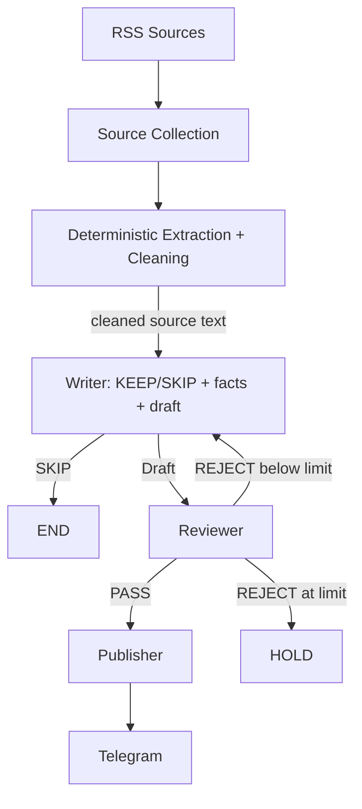

# Daily Chip News

[简体中文](README.md) | **English**

Daily Chip News is a daily automation workflow for semiconductor industry intelligence.

It collects recent items from several industry RSS feeds, extracts and cleans the article text with deterministic code, and sends each candidate through two focused AI nodes:

**Writer → Reviewer → Telegram**

The Writer makes one high-quality call that judges relevance, extracts evidence-backed facts, and produces concise Chinese coverage. The Reviewer checks factual support, relevance, and writing quality against a fixed rubric. Approved content is delivered to Telegram by the Publisher. The repository has accumulated more than 230 scheduled GitHub Actions runs.

## Workflow



LangGraph `StateGraph` coordinates the two AI nodes, while the deterministic Publisher handles delivery. A draft may be revised once by default (`MAX_REVISIONS=1`); another rejection moves the item to `HOLD`.

## The two AI nodes

### Writer

One Writer call does three things: decides whether the item matches the editorial scope, extracts evidence-backed research notes, and writes the Chinese draft. It has two modes:

- `compose`: receives article metadata, deterministically cleaned source text, the editorial scope/brief, and the output schema. Irrelevant items return `decision=SKIP` and never reach the Reviewer.
- `revise`: receives the Research Notes, the previous Draft, and the Revision Brief. It only applies the requested fixes and never refetches the source or adds facts.

The Writer is the quality-first step: medium reasoning (`WRITER_THINKING_LEVEL=medium`), a generous output budget (`WRITER_MAX_OUTPUT_TOKENS=16384`), and schema-constrained JSON output.

### Reviewer

The Reviewer applies a fixed rubric covering factual grounding, source support, unsupported claims, commercial relevance, recency, clarity, duplication, tone, length, and format.

It returns `PASS` or `REJECT`. Rejections include scores, issues, and a concise Revision Brief for the Writer to apply to the original Research Notes. The Reviewer runs with a lower reasoning budget (`REVIEWER_THINKING_LEVEL=low`) and is the lightest call in the pipeline.

## Sources

The daily candidate set currently comes from five feeds:

- [EE Times](https://www.eetimes.com/feed/)
- [Semiconductor Engineering](https://semiengineering.com/feed/)
- [ServeTheHome](https://www.servethehome.com/feed/)
- [TrendForce Semiconductors](https://www.trendforce.com/feed/Semiconductors.html)
- [Hacker News RSS](https://hnrss.org/newest?points=100)

Candidate URLs are deduplicated before Jina Reader extracts the article text. Deterministic `clean_extracted_text()` then removes reader metadata, image-only lines, rules, and repeated lines, and truncates to `ARTICLE_CONTENT_CHARS`, so the model receives dense context instead of raw page noise. If one RSS source is unavailable, the run records its source and error type and continues with the healthy feeds. Collection becomes a run-level failure only when every configured source is unavailable.

## Model routing

Each AI node has its own model setting:

- `WRITER_MODEL`: selected for Chinese writing quality and structured output.
- `REVIEWER_MODEL`: selected for fact checking, instruction following, and stable judgment.

Choose model names from those currently available to the Gemini account. The two settings may use the same model or different models.

## Installation and configuration

Python 3.11 is recommended:

```bash
python -m venv .venv
.venv\Scripts\activate
python -m pip install -r requirements.txt
```

Copy `.env.example` to `.env` and provide local settings:

```env
GEMINI_API_KEY=your_gemini_api_key
WRITER_MODEL=your_writer_model
REVIEWER_MODEL=your_reviewer_model
TELEGRAM_BOT_TOKEN=your_telegram_bot_token
TELEGRAM_CHAT_ID=your_telegram_chat_id
ARTICLES_PER_FEED=2
MAX_REVISIONS=1
```

Git ignores `.env`. The Gemini API key is sent in the `x-goog-api-key` header. GitHub Actions reads credentials from Repository Secrets and model names from Repository Variables.

## Generation quality and call budget

Every setting below is optional; the default is the recommended value:

| Variable | Default | Purpose |
| --- | --- | --- |
| `WRITER_THINKING_LEVEL` | `medium` | Writer reasoning level: `low/medium/high/off` |
| `REVIEWER_THINKING_LEVEL` | `low` | Reviewer reasoning level |
| `WRITER_MAX_OUTPUT_TOKENS` | `16384` | Writer token ceiling so JSON is never truncated |
| `REVIEWER_MAX_OUTPUT_TOKENS` | `8192` | Reviewer token ceiling |
| `ARTICLE_CONTENT_CHARS` | `16000` | Cleaned source characters sent to the Writer |
| `GEMINI_TIMEOUT_SECONDS` | `180` | Per-request HTTP timeout (30-300 s) |
| `GEMINI_MAX_ATTEMPTS` | `5` | Requests per logical call (1-8) |
| `GEMINI_CALL_BUDGET_SECONDS` | `240` | Total time budget for one logical call, retries included |
| `GEMINI_STRUCTURED_OUTPUT` | `1` | Send `responseSchema` to constrain JSON |
| `GEMINI_HEALTH_WINDOW` | `5` | Rolling-window breaker size |
| `GEMINI_HEALTH_THRESHOLD` | `3` | Transient failures inside the window that mean "service down" |
| `RUN_BUDGET_SECONDS` | `2100` | Whole-run processing budget so outages cannot run forever |

The principle: **let one Gemini call take longer to protect generation quality**. Scheduled runs may take a few more minutes, but every timeout stays bounded: each logical call is capped by `GEMINI_CALL_BUDGET_SECONDS`, the whole run by `RUN_BUDGET_SECONDS`, and that run budget is also passed to the client as a hard deadline (per-request timeouts are clamped to the remaining budget), so the worst-case total stays bounded.

## Run locally

```bash
python main.py
```

For a smaller local smoke test, override the candidate count only for the current process:

```powershell
$env:ARTICLES_PER_FEED = "1"
python main.py
```

## GitHub Actions

`.github/workflows/daily_news.yml` targets 06:55 every day in `Asia/Shanghai` (UTC+08:00), represented as `55 22 * * *` in GitHub's UTC cron, and also supports manual `workflow_dispatch` runs. GitHub does not guarantee an exact start time for scheduled workflows. The job uses `timeout-minutes: 60` to stay above `RUN_BUDGET_SECONDS`.

Configure these Repository Secrets:

- `GEMINI_API_KEY`
- `TELEGRAM_BOT_TOKEN`
- `TELEGRAM_CHAT_ID`

And these Repository Variables:

- `WRITER_MODEL`
- `REVIEWER_MODEL`

## Run outcome state machine

Every run ends in exactly one of four states, and that state decides the GitHub Actions status:

| Outcome | Condition | exit code |
| --- | --- | --- |
| `SUCCESS` | Completed normally, `published > 0`, no article failure | 0 |
| `PARTIAL_SUCCESS` | `published > 0`, but some articles failed, the breaker opened, or the budget ran out | 0 |
| `EMPTY_SUCCESS` | No candidates, or every candidate was filtered by the editorial rules (`SKIP`/`HOLD`) | 0 |
| `FAILED` | Articles needed processing but `published == 0` with processing/service failures, or a program-level fault | 1 |

Key semantics: **once at least one article is published, later Gemini failures never redefine the run as FAILED**, and a genuine system outage with `published == 0` is never disguised as success.

## Error taxonomy and breaker

Failures are grouped into three layers and aggregated by category in the summary:

```text
TRANSIENT_RATE_LIMIT / TRANSIENT_SERVER / TRANSIENT_NETWORK    service-level, counted by the breaker
MODEL_RESPONSE_INVALID / MODEL_RESPONSE_TRUNCATED / SCHEMA_INVALID   article-level
SOURCE_ERROR / PUBLISH_ERROR / CONFIG_ERROR / UNEXPECTED_ERROR       article- or run-level
```

The breaker is a rolling window, not a consecutive-failure counter:

```text
Among the last GEMINI_HEALTH_WINDOW(5) AI logical calls (one event per Writer/Reviewer call),
transient failures (429 / 5xx / network / timeout) reaching GEMINI_HEALTH_THRESHOLD(3) mean the service is unavailable
```

Success and failure events share one granularity: a successful call records SUCCESS, a retry-exhausted transient failure records TRANSIENT, and `GeminiResponseError` / `SchemaError` records NEUTRAL. Successful calls enter the window normally and evict old failures; NEUTRAL events occupy a slot without counting as transient and without erasing history. When the breaker opens, the log prints the full window:

```text
Gemini service breaker OPEN | window=[T,T,S,N,T] transient=3/5 threshold=3 | last=stage=reviewer category=TRANSIENT_SERVER | published=1 | action=stop_processing
```

### Gemini retry configuration

- HTTP 429 honours `Retry-After` first (capped at 120 s); without the header it uses exponential backoff.
- 5xx / network / timeout use exponential backoff 2s -> 4s -> 8s -> 16s with jitter, capped at 30 s per sleep.
- Every retry logs the attempt, HTTP status, whether `Retry-After` was present, the backoff duration, and the reason. Logs never contain keys, headers, or request payloads.
- Output cut off by `maxOutputTokens` is classified as `MODEL_RESPONSE_TRUNCATED` instead of being blindly retried.

### JSON tolerance

Structured output uses `responseSchema` first. Defensive parsing then runs: direct parse -> fenced json block extraction -> at most one format-only repair call (sharing the original logical-call deadline) -> otherwise an article-level `GeminiResponseError`. Fields are never guessed and semantics are never rewritten.

## Failure isolation

Failures are isolated at both source and article level:

```text
Source A → OK
Source B → FAILED → record and continue
Source C → OK

Article A → PASS   → publish
Article B → FAILED → record and continue
Article C → SKIP   → continue
Article D → PASS   → publish
```

Article extraction, structured JSON, schema validation, and an isolated transient request failure affect only the current item. Gemini authentication, permission, or model-configuration errors stop further processing, but a run that already published articles is still `PARTIAL_SUCCESS` (exit 0) with an operational alert; without any publication it is `FAILED`. Program-level faults (unexpected exceptions, invalid terminal state) are always `FAILED`. Both `PARTIAL_SUCCESS` and `FAILED` make a best-effort operational alert through the deterministic Telegram Publisher without calling Gemini.

Every run ends with one grouped summary covering the outcome, sources, article processing, Gemini call statistics, and Writer/Reviewer detail:

```text
Run summary:
  run_outcome: PARTIAL_SUCCESS
  exit_code: 0
  sources_total: 5
  sources_ok: 5
  sources_failed: 0
  candidates: 10
  processed: 6
  published: 2
  skipped: 1
  held: 0
  failed: 3
  revisions: 0
  workflow_status: PASS

Articles:
  discovered / eligible / processed / published / skipped / held / failed
  failure_categories:
    TRANSIENT_SERVER: 3

Gemini:
  requests / successful / retries / transient_failures
  rate_limit_429 / server_5xx / network
  response_invalid / response_truncated / thinking_downgrades
  breaker_triggered / health_window

Writer:    calls / success / skipped / failures / json_repair_attempts / json_repair_success
Reviewer:  calls / success / rejected / failures
```

Source and article failure records contain only the source URL or name, article title, processing stage, error category, error type, and (when available) a safe HTTP status code; provider error messages are not printed.

## Calls per article

```text
before: Writer(1) + Reviewer(1) + Researcher(1)     typical 3, worst 6-7
after:  Writer(1) + Reviewer(1)                     typical 2, worst 4
        +1 revision (only on Reviewer REJECT)
        +1 JSON repair (only when the model output is invalid)
```

## Tests

Unit tests use fake and mock clients, so they do not require live Gemini or Telegram credentials:

```bash
python -m compileall .
python -m unittest discover -s tests
```

## Project structure

```text
.
├─ src/daily_chip_news/
│  ├─ app.py          # batch orchestration, outcome decision, summary
│  ├─ config.py       # environment settings and editorial constants
│  ├─ errors.py       # failure taxonomy and routing flags
│  ├─ gemini.py       # Gemini client: retry/timeout/structured JSON
│  ├─ graph.py        # LangGraph StateGraph
│  ├─ health.py       # rolling-window service health
│  ├─ metrics.py      # run-level counters
│  ├─ outcomes.py     # outcome state machine and exit codes
│  ├─ publisher.py
│  ├─ schemas.py
│  ├─ sources.py      # RSS collection, extraction, deterministic cleaning
│  └─ nodes/
│     ├─ writer.py
│     └─ reviewer.py
├─ tests/
├─ docs/architecture.md
├─ .github/workflows/daily_news.yml
├─ .env.example
├─ main.py
└─ requirements.txt
```

See [`docs/architecture.md`](docs/architecture.md) for state, data contracts, context boundaries, and failure routing.
