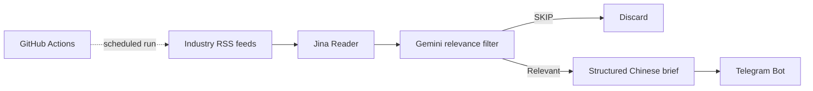
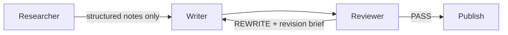

# Daily Chip News

> An AI-assisted semiconductor intelligence workflow that turns scattered industry updates into a focused daily brief for semiconductor sales and business-facing roles.

Daily Chip News started from a practical problem: semiconductor sales work requires continuous attention to foundries, chip vendors, memory pricing, supply-chain changes, and B2B hardware trends, but the useful signals are buried in a large amount of low-relevance content.

The project automates the repetitive part of that workflow:

**collect → extract → filter → summarize → deliver**

It is intentionally small. The goal is not to build a general news platform, but to test how AI can replace repetitive information triage while keeping the editorial criteria explicit.

## What it does

- Collects recent articles from selected semiconductor and hardware RSS sources.
- Uses Jina Reader to convert article pages into cleaner text for downstream processing.
- Uses Gemini to judge whether each article has commercial or technical value for a semiconductor sales context.
- Produces a short Chinese brief containing the core development and key data points.
- Sends qualified items to Telegram.
- Runs automatically every day through GitHub Actions.

## Current workflow — V1



Current source categories include:

- Semiconductor industry media
- Process / manufacturing coverage
- Enterprise and server hardware
- Market and supply-chain trend sources
- Selected broader technology signals

The filtering prompt prioritizes topics such as foundry expansion, process-node progress, major chip-vendor releases, supply-chain shortages or price changes, and B2B hardware technologies including HBM, CXL, and RISC-V.

## Why this project exists

The useful part of the project is not "a bot that summarizes news". The useful part is the workflow design around a real information task:

1. Define what counts as a useful signal for a specific business role.
2. Reduce noisy source material before it reaches the language model.
3. Keep the AI output short and structured.
4. Automate delivery so the workflow can run without manual prompting.
5. Observe where a single-model pipeline is insufficient and introduce explicit quality control in the next iteration.

The repository has accumulated **230+ scheduled workflow runs** in GitHub Actions history as of August 2026, providing a long-running test bed rather than a one-off API demo.

## Stack

| Layer | Tool |
| --- | --- |
| Source collection | RSS / `feedparser` |
| Content extraction | Jina Reader |
| AI processing | Gemini API |
| Delivery | Telegram Bot API |
| Scheduling | GitHub Actions |
| Runtime | Python 3 |

## Repository structure

```text
.
├── .github/
│   └── workflows/
│       └── daily_news.yml     # scheduled execution
├── docs/
│   └── architecture.md        # current architecture + V2 micro-graph design
├── .env.example               # required environment variables
├── .gitignore
├── main.py                    # current V1 pipeline
├── requirements.txt
└── README.md
```

## Run locally

1. Install dependencies:

```bash
pip install -r requirements.txt
```

2. Create local environment variables based on `.env.example`:

```bash
GEMINI_API_KEY=...
TELEGRAM_BOT_TOKEN=...
TELEGRAM_CHAT_ID=...
GEMINI_MODEL=gemini-3.5-flash-lite
```

3. Run:

```bash
python main.py
```

Do not commit real API keys or Telegram credentials.

## Automated execution

The GitHub Actions workflow runs once per day and also supports manual execution from the Actions tab. Credentials are injected through GitHub Actions Secrets.

The current maintenance goal is to make failures visible rather than silently treating an API error as an editorial `SKIP` decision.

## V2 direction: a three-node editorial micro-graph

The next iteration deliberately stays small:



The design separates three responsibilities:

- **Researcher** — retrieves and extracts evidence, but does not write the final copy.
- **Writer** — receives a fresh context containing only the editorial brief and structured research notes.
- **Reviewer** — checks the draft against an explicit rubric for grounding, relevance, clarity, duplication, recency, tone, and formatting.

A rejected draft returns to the Writer with a concise revision brief. Revision attempts are capped to prevent an uncontrolled loop.

This is a context-isolation and QA design, not an attempt to create a large multi-agent system. See [`docs/architecture.md`](docs/architecture.md) for the planned data contracts and review loop.

## Current limitations

V1 is intentionally simple and has known limitations:

- Core logic is still concentrated in one script.
- A single model currently handles both relevance judgment and summarization.
- Article deduplication and daily digest aggregation are limited.
- Operational observability is basic.
- The V2 Researcher → Writer → Reviewer graph is a planned upgrade and is **not yet represented as completed functionality**.

These limitations are kept explicit so the repository reflects the actual project state rather than presenting a prototype as a finished production system.
