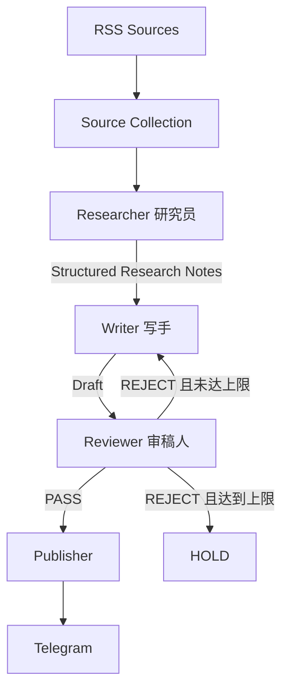

# Daily Chip News

**简体中文** | [English](README.en.md)

Daily Chip News 是一个每日运行的半导体行业情报自动化工作流。

它从多个行业 RSS 获取最新内容，提取正文后交给三个职责独立的 AI 节点处理：

**Researcher → Writer → Reviewer → Telegram**

Researcher 提取有价值的事实与来源，Writer 根据结构化研究笔记生成中文内容，Reviewer 按固定标准检查事实、相关性和表达质量。审核通过后，Publisher 将内容推送至 Telegram。仓库历史已累计 230+ 次 GitHub Actions 定时运行。

## Workflow



工作流使用 LangGraph `StateGraph` 编排三个 AI 节点，并由确定性的 Publisher 完成发送。默认最多返工两次，达到上限后进入 `HOLD`。

## 三个节点

### Researcher

Researcher 获取候选文章正文，判断内容是否符合编辑范围，并输出结构化 Research Notes。笔记包含主题、来源、链接、发布日期，以及带证据与置信度的事实条目。语义无关的文章返回 `SKIP`。

### Writer

Writer 每次只接收 Editorial Brief、Structured Research Notes、输出结构，以及返工时的 Revision Brief。原始网页正文停留在 Researcher，节点之间通过结构化对象交接。

Writer 输出标题、摘要、关键事实、关注理由和 Telegram 文案，整体风格保持中文、简洁、克制、事实优先。

### Reviewer

Reviewer 根据固定 Rubric 检查 factual grounding、source support、unsupported claims、commercial relevance、recency、clarity、duplication、tone、length 和 format。

审核结果为 `PASS` 或 `REJECT`。拒绝时返回评分、问题清单和精简 Revision Brief，由 Writer 根据原 Research Notes 修改。

## 信息来源

当前每天从五类来源收集候选文章：

- [EE Times](https://www.eetimes.com/feed/)
- [Semiconductor Engineering](https://semiengineering.com/feed/)
- [ServeTheHome](https://www.servethehome.com/feed/)
- [TrendForce Semiconductors](https://www.trendforce.com/feed/Semiconductors.html)
- [Hacker News RSS](https://hnrss.org/newest?points=100)

候选链接先按 URL 去重，再通过 Jina Reader 提取正文。单个 RSS 不可用时会记录来源和错误类型，其余健康来源继续产生 candidates；仅在所有来源均不可用时终止本次运行。

## Model Routing

三个节点分别读取自己的模型配置：

- `RESEARCHER_MODEL`：适合高吞吐、信息抽取和结构化输出。
- `WRITER_MODEL`：侧重中文生成质量。
- `REVIEWER_MODEL`：侧重事实检查、规则遵循和判断稳定性。

具体型号根据 Gemini 账户当前可用模型配置，三个值可以相同，也可以分别设置。

## 安装与配置

建议使用 Python 3.11：

```bash
python -m venv .venv
.venv\Scripts\activate
python -m pip install -r requirements.txt
```

复制 `.env.example` 为 `.env`，填写本地配置：

```env
GEMINI_API_KEY=your_gemini_api_key
RESEARCHER_MODEL=your_researcher_model
WRITER_MODEL=your_writer_model
REVIEWER_MODEL=your_reviewer_model
TELEGRAM_BOT_TOKEN=your_telegram_bot_token
TELEGRAM_CHAT_ID=your_telegram_chat_id
ARTICLES_PER_FEED=2
MAX_REVISIONS=2
```

`.env` 已由 Git 忽略。Gemini API key 通过 `x-goog-api-key` header 发送；GitHub Actions 中的凭证使用 Repository Secrets，模型名称使用 Repository Variables。

## 本地运行

```bash
python main.py
```

减少本地 smoke test 的候选数量时，可只为当前进程设置：

```powershell
$env:ARTICLES_PER_FEED = "1"
python main.py
```

## GitHub Actions

`.github/workflows/daily_news.yml` 每天北京时间 06:55 定时运行，也支持 `workflow_dispatch` 手动触发。

需要配置以下 Repository Secrets：

- `GEMINI_API_KEY`
- `TELEGRAM_BOT_TOKEN`
- `TELEGRAM_CHAT_ID`

以及 Repository Variables：

- `RESEARCHER_MODEL`
- `WRITER_MODEL`
- `REVIEWER_MODEL`

## 错误与失败隔离

来源层和文章层分别隔离失败：

```text
Source A → OK
Source B → FAILED → 记录并继续
Source C → OK

Article A → PASS   → 发布
Article B → FAILED → 记录并继续
Article C → SKIP   → 继续
Article D → PASS   → 发布
```

正文提取、结构化 JSON、schema 校验或单篇瞬态调用失败只影响当前文章。Gemini 认证、模型配置、持续服务不可用、Telegram 认证/目标配置，以及所有 RSS 均不可用属于运行级故障。

每次运行结束时都会输出统一 summary：

```text
Run summary:
  sources_total: ...
  sources_ok: ...
  sources_failed: ...
  candidates: ...
  processed: ...
  published: ...
  skipped: ...
  held: ...
  failed: ...
  revisions: ...
  workflow_status: PASS or FAIL
```

来源和文章失败记录仅包含来源 URL / 名称、文章标题、处理阶段和错误类型。

## 测试

单元测试使用 fake/mock client，无需真实 Gemini 或 Telegram 凭证：

```bash
python -m compileall .
python -m unittest discover -s tests
```

## 项目结构

```text
.
├─ src/daily_chip_news/
│  ├─ app.py
│  ├─ config.py
│  ├─ gemini.py
│  ├─ graph.py
│  ├─ publisher.py
│  ├─ schemas.py
│  ├─ sources.py
│  └─ nodes/
│     ├─ researcher.py
│     ├─ writer.py
│     └─ reviewer.py
├─ tests/
├─ docs/architecture.md
├─ .github/workflows/daily_news.yml
├─ .env.example
├─ main.py
└─ requirements.txt
```

状态、数据契约、上下文边界和失败路由详见 [`docs/architecture.md`](docs/architecture.md)。
