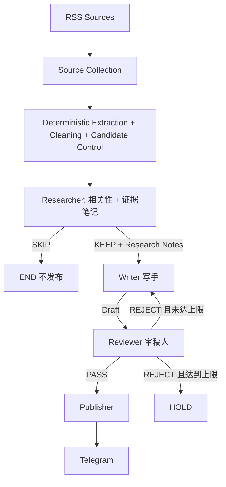

# Daily Chip News

**简体中文** | [English](README.en.md)

Daily Chip News 是一个每日运行的半导体行业情报自动化工作流。

它从多个行业 RSS 获取最新内容，用确定性代码完成正文提取、清洗与候选控制，再交给三个职责独立的 AI 节点处理：

**Researcher → Writer → Reviewer → Telegram**

Researcher 读取正文并输出结构化研究笔记；Writer 只根据研究笔记写中文成稿；Reviewer 按固定标准审核。审核通过后由确定性的 Publisher 推送至 Telegram。仓库历史已累计 230+ 次 GitHub Actions 定时运行。

## Workflow



LangGraph `StateGraph` 编排三个 AI 节点，Publisher 保持确定性。默认最多返工一次（`MAX_REVISIONS=1`），达到上限进入 `HOLD`。

## 三个 AI 节点

### Researcher

唯一读取文章正文的 AI 节点。它依据 editorial scope 判断相关性（`KEEP`/`SKIP`），并输出结构化 Research Notes：topic、来源、链接、日期，以及 1-4 条带证据与置信度的事实笔记。

### Writer

首稿只读取 Research Notes + editorial brief + 输出 schema，看不到正文、不能访问原网页、不得补充笔记之外的事实。返工时只读取 `research_notes` + `previous_draft` + `revision_brief`，不会重新调用 Researcher，也不会改变事实基础。

### Reviewer

只读取 Research Notes + Draft + rubric，只审核不重写。`PASS` 后交给 Publisher；`REJECT` 时输出精简 `revision_brief` 触发一次 Writer 返工。

## 信息来源与候选控制

当前每天从五类来源收集候选文章：

- [EE Times](https://www.eetimes.com/feed/)
- [Semiconductor Engineering](https://semiengineering.com/feed/)
- [ServeTheHome](https://www.servethehome.com/feed/)
- [TrendForce Semiconductors](https://www.trendforce.com/feed/Semiconductors.html)
- [Hacker News RSS](https://hnrss.org/newest?points=100)

确定性候选控制（0 Gemini 成本）：URL/canonical 去重 → 去除明显垃圾（广告、招聘、导航页、过短标题）→ 按来源 round-robin + 组内 recency 排序 → `MAX_CANDIDATES_PER_RUN=6` 截断。正文提取后由 `clean_extracted_text()` 去掉 reader 元数据、图片/分隔线、重复行，并按 `ARTICLE_CONTENT_CHARS=12000` 截断。单个 RSS 不可用只影响该来源；所有来源均不可用时终止本次运行。

## Model Routing

- `RESEARCHER_MODEL`：轻量抽取模型（当前 `gemini-3.5-flash-lite`）。
- `WRITER_MODEL`：中文生成质量（当前 `gemini-3.6-flash`）。
- `REVIEWER_MODEL`：事实检查与判断稳定性（当前 `gemini-3.7-flash`）。

三个节点全部使用 `thinking=low`，输出上限分别为 3072 / 2560 / 1024 tokens，结构化输出保留 `responseSchema`，`candidateCount=1`，不使用 Search grounding 等付费工具。

## 成本治理（$10 赠金下的硬预算）

三层保护：

```text
application guard（代码层，主保险）
→ project spend cap（Owner 在 AI Studio/Cloud 设置，建议 $8）
→ $10/月 promotional credit
```

代码层预算：

| 变量 | 默认 | 作用 |
| --- | --- | --- |
| `SCHEDULED_RUN_BUDGET_USD` | `0.20` | 定时任务单次 run 的付费上限 |
| `MANUAL_RUN_BUDGET_USD` | `0.05` | 手工 `workflow_dispatch` 单次上限，代码硬上限 `0.10` |
| `GEMINI_ROLLING_30D_BUDGET_USD` | `7.50` | rolling 30 天总上限，任何 run 都不能突破 |

- 31 天全部跑满 ≈ $6.20，剩余 ≈ $1.30 作为价格误差、手工运行与 billing 延迟的余量。
- **成本保护优先于处理完所有候选文章**：预算不足时直接停止，不会为了完成任务临时抬高预算。

### 调用前 preflight（fail closed）

每次真正可能计费的 `generateContent` 之前：

1. `countTokens` 取该请求的准确输入 token（与 generation 等价的 systemInstruction/contents）；失败即拒绝调用。
2. 查价格表：模型未知或价格已过期即拒绝调用。
3. 计算 worst-case：`输入 × 1.05 × 输入单价 + max_output_tokens × 输出单价`（thinking tokens 计入输出）。
4. 检查 `run_spend + projected ≤ run_budget` 且 `rolling_30d_spend + projected ≤ 7.50`；任一不满足 → 不发送请求、不 retry、不换模型。

### 计费与账本

- 每个成功返回 200 的请求按 `usageMetadata` 独立计费（`prompt` + `candidates` + `thoughts`），retry 中每次成功分别计入，JSON repair 也是独立 billable request。
- 每次请求先写入 reservation（worst-case），成功后按 actual 结算；timeout/网络不确定时**保留 reservation**，绝不假设"没花钱"。
- rolling 30 天账本为 JSONL，通过 GitHub Actions artifact 跨 run 持久化（`retention-days: 45`，`concurrency` 单实例）；run 开始先落地整场预算的 run_open 预留，结束结算为实际值，因此 run 崩溃也不会低估花费。
- 账本损坏、缺失（`COST_LEDGER_REQUIRED=1`）或 artifact 读取失败 → fail closed，禁止付费调用。

## 运行结果状态机

| Outcome | 触发条件 | exit code |
| --- | --- | --- |
| `SUCCESS` | 正常完成，`published > 0`，无失败 | 0 |
| `PARTIAL_SUCCESS` | `published > 0`，但存在文章失败 / breaker 打开 / 时间预算耗尽 | 0 |
| `EMPTY_SUCCESS` | 没有候选，或候选全部 `SKIP`/`HOLD` | 0 |
| `COST_GUARD_STOPPED` | 成本保护主动停止（预算不足） | 0 |
| `FAILED` | `published == 0` 且存在失败/服务不可用；或程序级故障 | 1 |

关键语义：已发布文章后后续 Gemini 故障不会把 run 重新定义为 FAILED；成本保护停止是预期运营状态，不标红、不污染 Gemini health window；`published == 0` 的真实系统故障不会被伪装成成功。

## 错误分类与熔断

```text
TRANSIENT_RATE_LIMIT / TRANSIENT_SERVER / TRANSIENT_NETWORK   服务级，计入熔断
MODEL_RESPONSE_INVALID / MODEL_RESPONSE_TRUNCATED / SCHEMA_INVALID   文章级
SOURCE_ERROR / PUBLISH_ERROR / CONFIG_ERROR / COST_GUARD / UNEXPECTED_ERROR
```

rolling window 熔断：最近 `GEMINI_HEALTH_WINDOW(5)` 个 AI 逻辑调用中，瞬态失败达到 `GEMINI_HEALTH_THRESHOLD(3)` 即判定服务不可用。粒度固定为 **1 个 logical call = 1 个事件**（成功与失败同粒度）；`SchemaError`/`GeminiResponseError` 占位但不计瞬态，也不清空历史；`COST_GUARD` 不进入窗口。

retry：429 优先遵守 `Retry-After`（上限 120s）；5xx/network/timeout 指数退避 2s→4s→8s→16s + jitter；单次逻辑调用受 `GEMINI_CALL_BUDGET_SECONDS=240` 约束，整场受 `RUN_BUDGET_SECONDS=2100` 约束，HTTP timeout 会被 clamp 到剩余预算。

## 安装与配置

```bash
python -m venv .venv
.venv\Scripts\activate
python -m pip install -r requirements.txt
```

复制 `.env.example` 为 `.env` 并填写：

```env
GEMINI_API_KEY=your_gemini_api_key
RESEARCHER_MODEL=your_researcher_model
WRITER_MODEL=your_writer_model
REVIEWER_MODEL=your_reviewer_model
TELEGRAM_BOT_TOKEN=your_telegram_bot_token
TELEGRAM_CHAT_ID=your_telegram_chat_id
ARTICLES_PER_FEED=2
MAX_REVISIONS=1
```

`.env` 已由 Git 忽略；Gemini key 通过 `x-goog-api-key` header 发送。GitHub Actions 的凭证来自 Repository Secrets，模型名来自 Repository Variables。

## GitHub Actions

每天北京时间 06:55（`55 22 * * *` UTC）运行，也支持 `workflow_dispatch`。job `timeout-minutes: 60`，`concurrency.cancel-in-progress: false`（账本单实例）。

手工触发参数：

- `paid_budget_usd`：本次手工运行付费上限，默认 `0.05`，代码硬上限 `0.10`。
- `ledger_anchor_usd`：仅用于账本丢失后的恢复 re-anchor，正常不要使用。

流程：`Prepare cost ledger`（读取上一版 artifact、写入 run_open 预留）→ `python main.py` → `Upload cost ledger`（`if: always()`，保证崩溃/失败也保存）。

## 本地运行

```bash
python main.py
```

本地运行默认 `RUN_MODE=manual`，`COST_LEDGER_PATH` 未设置时不写账本；设置 `COST_LEDGER_PATH` 即可本地演练账本逻辑。

## 单篇调用次数

```text
典型（KEEP → PASS）：Researcher 1 + Writer 1 + Reviewer 1 = 3 次
一次返工：           + Writer 1 + Reviewer 1                = 5 次
SKIP：               仅 Researcher 1 次
JSON repair：        仅输出非法时 +1 次（独立计费）
```

## 测试

```bash
python -m compileall .
python -m unittest discover -s tests
```

## 项目结构

```text
.
├─ src/daily_chip_news/
│  ├─ app.py          # 批处理编排、outcome 判定、summary、账本接线
│  ├─ config.py       # 环境配置、预算解析、editorial 常量
│  ├─ cost.py         # 价格表与 token 成本计算
│  ├─ cost_guard.py   # preflight / reservation / reconcile
│  ├─ errors.py       # 错误分类与路由标记
│  ├─ gemini.py       # Gemini client：retry/timeout/countTokens/结构化 JSON
│  ├─ graph.py        # LangGraph StateGraph
│  ├─ health.py       # rolling-window 服务健康窗口
│  ├─ ledger.py       # rolling 30 天成本账本与 artifact 读取
│  ├─ metrics.py      # run 级计数器与 token/成本累计
│  ├─ outcomes.py     # 运行结果状态机与 exit code
│  ├─ publisher.py
│  ├─ schemas.py
│  ├─ sources.py      # RSS 收集、正文提取、清洗、候选控制
│  └─ nodes/
│     ├─ researcher.py
│     ├─ writer.py
│     └─ reviewer.py
├─ scripts/ledger_prepare.py
├─ tests/
├─ docs/architecture.md
├─ .github/workflows/daily_news.yml
├─ .env.example
├─ main.py
└─ requirements.txt
```

状态、数据契约、成本生命周期详见 [`docs/architecture.md`](docs/architecture.md)。
