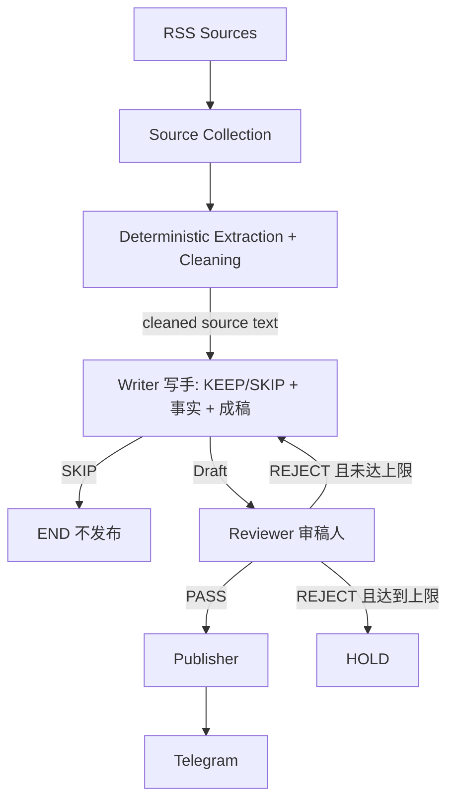

# Daily Chip News

**简体中文** | [English](README.en.md)

Daily Chip News 是一个每日运行的半导体行业情报自动化工作流。

它从多个行业 RSS 获取最新内容，用确定性代码完成正文提取与清洗，再交给两个职责独立的 AI 节点处理：

**Writer → Reviewer → Telegram**

Writer 在一次调用中完成相关性判断、事实提取和中文成稿；Reviewer 按固定标准检查事实、相关性和表达质量。审核通过后，Publisher 将内容推送至 Telegram。仓库历史已累计 230+ 次 GitHub Actions 定时运行。

## Workflow



工作流使用 LangGraph `StateGraph` 编排两个 AI 节点，并由确定性的 Publisher 完成发送。默认最多返工一次（`MAX_REVISIONS=1`），达到上限后进入 `HOLD`。

## 两个 AI 节点

### Writer

Writer 在一次高质量调用中完成三件事：判断文章是否符合 editorial scope、提取带证据的事实笔记、生成中文成稿。它有两种 mode：

- `compose`：接收文章元数据 + 本地清洗后的正文 + editorial scope/brief + 输出 schema。语义无关时返回 `decision=SKIP`，直接结束，不进入 Reviewer。
- `revise`：接收 Research Notes + 上一版 Draft + Revision Brief，只按修改点返工，不重新抓取正文、不新增事实。

Writer 使用中等级别 reasoning（`WRITER_THINKING_LEVEL=medium`）、较大的输出预算（`WRITER_MAX_OUTPUT_TOKENS=16384`）和结构化输出 schema，是质量优先步骤。

### Reviewer

Reviewer 根据固定 Rubric 检查 factual grounding、source support、unsupported claims、commercial relevance、recency、clarity、duplication、tone、length 和 format。

审核结果为 `PASS` 或 `REJECT`。拒绝时返回评分、问题清单和精简 Revision Brief，由 Writer 根据原 Research Notes 修改。Reviewer 使用较低 reasoning 预算（`REVIEWER_THINKING_LEVEL=low`），是整套流程中最轻量的调用。

## 信息来源

当前每天从五类来源收集候选文章：

- [EE Times](https://www.eetimes.com/feed/)
- [Semiconductor Engineering](https://semiengineering.com/feed/)
- [ServeTheHome](https://www.servethehome.com/feed/)
- [TrendForce Semiconductors](https://www.trendforce.com/feed/Semiconductors.html)
- [Hacker News RSS](https://hnrss.org/newest?points=100)

候选链接先按 URL 去重，再通过 Jina Reader 提取正文。提取后由确定性的 `clean_extracted_text()` 去掉 reader 元数据、图片/分隔线、重复行，并按 `ARTICLE_CONTENT_CHARS` 截断，保证模型拿到的是高信息密度文本而不是原始页面噪声。单个 RSS 不可用时会记录来源和错误类型，其余健康来源继续产生 candidates；仅在所有来源均不可用时终止本次运行。

## Model Routing

两个节点分别读取自己的模型配置：

- `WRITER_MODEL`：侧重中文生成质量与结构化输出。
- `REVIEWER_MODEL`：侧重事实检查、规则遵循和判断稳定性。

具体型号根据 Gemini 账户当前可用模型配置，两个值可以相同，也可以分别设置。

## 安装与配置

建议使用 Python 3.11：

```bash
python -m venv .venv
.venv\Scripts\activate
python -m pip install -r requirements.txt
```

复制 `.env.example` 为 `.env`，填写本地配置：

```env
GEMINI_API_KEY=your_gemini_api_key
WRITER_MODEL=your_writer_model
REVIEWER_MODEL=your_reviewer_model
TELEGRAM_BOT_TOKEN=your_telegram_bot_token
TELEGRAM_CHAT_ID=your_telegram_chat_id
ARTICLES_PER_FEED=2
MAX_REVISIONS=1
```

`.env` 已由 Git 忽略。Gemini API key 通过 `x-goog-api-key` header 发送；GitHub Actions 中的凭证使用 Repository Secrets，模型名称使用 Repository Variables。

## 生成质量与调用预算

这一节全部为可选配置，默认值即推荐值：

| 变量 | 默认 | 作用 |
| --- | --- | --- |
| `WRITER_THINKING_LEVEL` | `medium` | Writer reasoning 等级，可选 `low/medium/high/off` |
| `REVIEWER_THINKING_LEVEL` | `low` | Reviewer reasoning 等级 |
| `WRITER_MAX_OUTPUT_TOKENS` | `16384` | Writer 输出 token 上限，避免 JSON 被截断 |
| `REVIEWER_MAX_OUTPUT_TOKENS` | `8192` | Reviewer 输出 token 上限 |
| `ARTICLE_CONTENT_CHARS` | `16000` | 送入 Writer 的清洗后正文字符上限 |
| `GEMINI_TIMEOUT_SECONDS` | `180` | 单次 HTTP 请求超时（30–300 秒） |
| `GEMINI_MAX_ATTEMPTS` | `5` | 单次逻辑调用最多请求次数（1–8） |
| `GEMINI_CALL_BUDGET_SECONDS` | `240` | 单次逻辑调用（含 retry）总时间上限 |
| `GEMINI_STRUCTURED_OUTPUT` | `1` | 是否发送 `responseSchema` 约束 JSON |
| `GEMINI_HEALTH_WINDOW` | `5` | rolling-window breaker 窗口大小 |
| `GEMINI_HEALTH_THRESHOLD` | `3` | 窗口内瞬态失败达到该值判定服务不可用 |
| `RUN_BUDGET_SECONDS` | `2100` | 整场 run 的处理预算，防止无限拖长 |

原则：**允许一次 Gemini 调用花更长时间换取生成质量**。定时任务多跑几分钟是可接受的，但每个 timeout 都有上限：单次调用受 `GEMINI_CALL_BUDGET_SECONDS` 约束，整场 run 受 `RUN_BUDGET_SECONDS` 约束，且该预算同时作为 client 的硬 deadline 传入（HTTP timeout 会被 clamp 到剩余预算），因此最坏总时长仍有界。

## 本地运行

```bash
python main.py
```

减少本地 smoke test 的候选数量时，可只为当前进程设置：

```powershell
$env:ARTICLES_PER_FEED = "1"
python main.py
```

## GitHub Actions

`.github/workflows/daily_news.yml` 的目标时间是每天北京时间（`Asia/Shanghai`，UTC+08:00）06:55；GitHub cron 使用 `55 22 * * *`（UTC 22:55），也支持 `workflow_dispatch` 手动触发。GitHub 对 scheduled workflow 的启动时间不提供准点保证。job 的 `timeout-minutes` 为 60，与 `RUN_BUDGET_SECONDS` 保持余量。

需要配置以下 Repository Secrets：

- `GEMINI_API_KEY`
- `TELEGRAM_BOT_TOKEN`
- `TELEGRAM_CHAT_ID`

以及 Repository Variables：

- `WRITER_MODEL`
- `REVIEWER_MODEL`

## 运行结果状态机

每次 run 只会落在四个状态之一，并以此决定 GitHub Actions 的红绿：

| Outcome | 触发条件 | exit code |
| --- | --- | --- |
| `SUCCESS` | 正常完成，`published > 0`，无文章失败 | 0 |
| `PARTIAL_SUCCESS` | `published > 0`，但存在文章失败、breaker 打开或预算耗尽 | 0 |
| `EMPTY_SUCCESS` | 没有候选文章，或候选全部被正常规则过滤（`SKIP`/`HOLD`） | 0 |
| `FAILED` | 有文章要处理但 `published == 0` 且存在处理失败/服务不可用；或出现程序级故障 | 1 |

关键语义：**已经成功发布文章后，后续 Gemini 故障不会把整场 run 重新定义为 FAILED**。`published == 0` 的真实系统故障也不会被伪装成成功。

## 错误分类与熔断

失败分为三层，全局 summary 会按类别聚合：

```text
TRANSIENT_RATE_LIMIT / TRANSIENT_SERVER / TRANSIENT_NETWORK   服务级，计入熔断
MODEL_RESPONSE_INVALID / MODEL_RESPONSE_TRUNCATED / SCHEMA_INVALID   文章级
SOURCE_ERROR / PUBLISH_ERROR / CONFIG_ERROR / UNEXPECTED_ERROR      文章级或运行级
```

熔断使用 rolling-window，而不是"连续两次失败"：

```text
最近 GEMINI_HEALTH_WINDOW(5) 个 AI 处理结果中，
瞬态失败（429 / 5xx / network / timeout）达到 GEMINI_HEALTH_THRESHOLD(3) 即判定服务不可用
```

成功完成会正常进入窗口并挤出旧失败；`SchemaError`、`GeminiResponseError` 等文章级错误占窗口位置但不计入瞬态，也不会清空历史。breaker 打开时日志会打印完整窗口，例如：

```text
Gemini service breaker OPEN | window=[T,T,S,N,T] transient=3/5 threshold=3 | last=stage=reviewer category=TRANSIENT_SERVER | published=1 | action=stop_processing
```

### Gemini retry 配置

- 429 优先读取并遵守 `Retry-After`（上限 `retry_after_cap=120s`），无该 header 时使用指数退避。
- 5xx / network / timeout 使用指数退避 2s → 4s → 8s → 16s，带 jitter，单次 sleep 上限 30s。
- 每次 retry 都会记录 attempt、http status、是否出现 `Retry-After`、backoff 时长和 reason；日志不包含 key、header 或请求体。
- 输出被 `maxOutputTokens` 截断时归类为 `MODEL_RESPONSE_TRUNCATED`，不会盲目重试。

### JSON 容错

结构化输出优先使用 `responseSchema` 约束；防御性解析顺序为：直接解析 → 提取 fenced ```json → 最多一次"只修格式、不改内容"的 repair 调用 → 仍失败则记为文章级 `GeminiResponseError`。不做字段猜测或语义修复。

## 错误与失败隔离

来源层和文章层分别隔离失败：

```text
Source A → OK
Source B → FAILED → 记录并继续
Source C → OK

Article A → PASS   → 发布
Article B → FAILED → 记录并继续
Article C → SKIP   → 继续
Article D → PASS   → 发布
```

正文提取、结构化 JSON、schema 校验或单篇瞬态调用失败只影响当前文章。Gemini 认证/权限/模型配置错误会停止继续处理，但若已经发布过文章仍记为 `PARTIAL_SUCCESS`（exit 0）并发送运维告警；未发布任何文章则为 `FAILED`。程序级异常（unexpected exception、非法终态）始终为 `FAILED`。`PARTIAL_SUCCESS` 与 `FAILED` 都会尝试通过确定性的 Telegram Publisher 发送运维告警，不经过 Gemini。

每次运行结束时都会输出统一 summary，包含 outcome、来源、文章处理、Gemini 调用统计、Writer/Reviewer 明细：

```text
Run summary:
  run_outcome: PARTIAL_SUCCESS
  exit_code: 0
  sources_total: 5
  sources_ok: 5
  sources_failed: 0
  candidates: 10
  processed: 6
  published: 2
  skipped: 1
  held: 0
  failed: 3
  revisions: 0
  workflow_status: PASS

Articles:
  discovered / eligible / processed / published / skipped / held / failed
  failure_categories:
    TRANSIENT_SERVER: 3

Gemini:
  requests / successful / retries / transient_failures
  rate_limit_429 / server_5xx / network
  response_invalid / response_truncated / thinking_downgrades
  breaker_triggered / health_window

Writer:    calls / success / skipped / failures / json_repair_attempts / json_repair_success
Reviewer:  calls / success / rejected / failures
```

来源和文章失败记录仅包含来源 URL / 名称、文章标题、处理阶段、错误类别、错误类型，以及可用时的安全 HTTP status code；不会输出 provider 原始错误消息。

## 单篇调用次数

```text
before: Writer(1) + Reviewer(1) + Researcher(1)     典型 3 次/篇，最多 6-7 次/篇
after:  Writer(1) + Reviewer(1)                     典型 2 次/篇，最多 4 次/篇
        +1 次 revision（仅 Reviewer REJECT）
        +1 次 JSON repair（仅在输出非法时）
```

## 测试

单元测试使用 fake/mock client，无需真实 Gemini 或 Telegram 凭证：

```bash
python -m compileall .
python -m unittest discover -s tests
```

## 项目结构

```text
.
├─ src/daily_chip_news/
│  ├─ app.py          # 批处理编排、outcome 判定、summary
│  ├─ config.py       # 环境配置与 editorial 常量
│  ├─ errors.py       # 错误分类与路由标记
│  ├─ gemini.py       # Gemini client：retry/timeout/结构化 JSON
│  ├─ graph.py        # LangGraph StateGraph
│  ├─ health.py       # rolling-window 服务健康窗口
│  ├─ metrics.py      # run 级计数器
│  ├─ outcomes.py     # 运行结果状态机与 exit code
│  ├─ publisher.py
│  ├─ schemas.py
│  ├─ sources.py      # RSS 收集、正文提取、确定性清洗
│  └─ nodes/
│     ├─ writer.py
│     └─ reviewer.py
├─ tests/
├─ docs/architecture.md
├─ .github/workflows/daily_news.yml
├─ .env.example
├─ main.py
└─ requirements.txt
```

状态、数据契约、上下文边界和失败路由详见 [`docs/architecture.md`](docs/architecture.md)。
