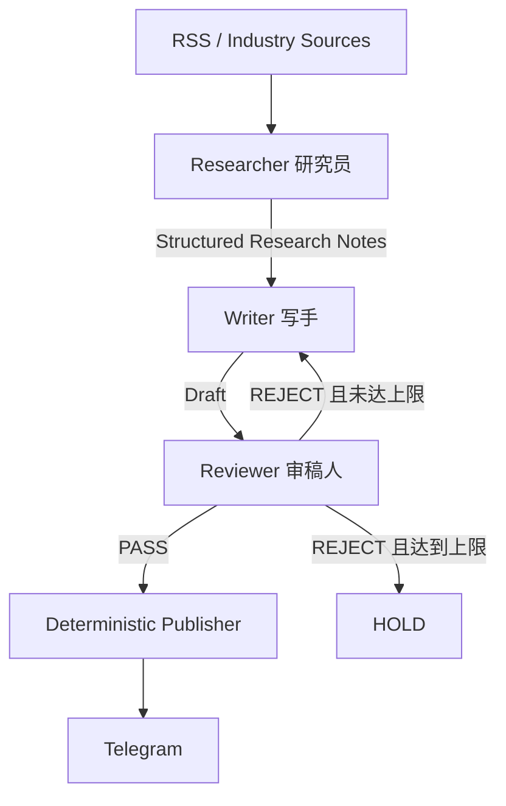

# Daily Chip News

**简体中文** | [English](README.en.md)

Daily Chip News 是一个面向半导体销售、AI 售前、解决方案和应用落地岗位的 AI 内容生产 Workflow。它解决的不是“让模型随便总结几条 RSS”，而是把分散的行业来源变成有证据、可审核、达到门槛后才发布的中文情报。

代码已经升级为 V2 Micro-Graph。仓库历史拥有 **230+ 次 GitHub Actions scheduled runs**；这是整个项目历史的运行记录，不代表这些运行全部由 V2 产生。V2 仍需在配置新的 Gemini Free Tier API key 和模型变量后完成首次在线验证。

## Workflow



V2 使用 LangGraph 的最小 `StateGraph`。严格只有三个 AI Agent 节点：

- **Researcher / 研究员**：获取候选文章正文、判断相关性、提取证据，只输出结构化 Research Notes。
- **Writer / 写手**：每次用 fresh context 写作，只看到 Editorial Brief、Research Notes、可选 Revision Brief 和输出结构。
- **Reviewer / 审稿人**：依据显式 Rubric 做 QA Gate，只给 `PASS` / `REJECT`、评分、问题和精简返工要求，不代替 Writer 改稿。

Publisher 是确定性基础设施，不是第四个 Agent。只有 Reviewer `PASS` 才会调用 Telegram；`SKIP`、`REJECT`、`HOLD` 和基础设施异常都不会发布。

## 为什么这样设计

单次大 Prompt 容易把抓取、推断、写作和自我审核混在一起。V2 用三项边界保持结果可解释：

1. **Context isolation**：原始网页正文停留在 Researcher；Writer 永远不接收正文、RSS 历史或 Researcher Prompt。
2. **Structured handoff**：节点之间只传机器可读的 Research Notes、Draft、Review 和 Revision Brief。
3. **QA gate + bounded revision**：Reviewer 拒绝后只把原 Research Notes 和精简返工要求交回 Writer；默认最多返工 2 次，仍不通过则 `HOLD`。

这让项目体现“识别场景 → 设计工作流 → PoC → QA”，不依赖数据库、Redis、向量库、RAG、MCP、Celery、Supervisor 或额外持久化。

## 数据契约

Researcher 的 KEEP 输出示例：

```json
{
  "decision": "KEEP",
  "reason": "与 HBM 供应相关",
  "topic": "HBM supply",
  "source": "Example Source",
  "url": "https://example.com/article",
  "published_at": "2026-08-24",
  "notes": [
    {
      "claim": "原文可以支持的事实",
      "evidence": "简短证据摘要",
      "why_it_matters": "对商业或技术决策的意义",
      "confidence": 0.9
    }
  ]
}
```

Writer 输出：

```json
{
  "headline": "...",
  "summary": "...",
  "key_facts": ["..."],
  "why_it_matters": "...",
  "telegram_copy": "..."
}
```

Reviewer 输出：

```json
{
  "status": "REJECT",
  "scores": {"factuality": 9, "relevance": 8, "clarity": 9},
  "issues": [{"severity": "major", "problem": "某项结论缺少来源支持"}],
  "revision_brief": ["删除缺乏研究笔记支持的结论"]
}
```

Reviewer Rubric 覆盖 factual grounding、source support、unsupported claims、commercial relevance、recency、clarity、duplication、tone、length 和 format。

## 独立模型路由

三个节点从配置层独立读取模型，不共享单一全局型号：

- `RESEARCHER_MODEL`：优先低成本、高吞吐和结构化抽取能力。
- `WRITER_MODEL`：更重视中文语言生成质量。
- `REVIEWER_MODEL`：更重视事实检查、规则遵循和判断稳定性。

仓库不预设当前一定可用的 Gemini 型号。创建 API key 后，根据该账户实际可用模型填写三个变量；它们可以相同，也可以真正不同。

## Secret 边界

仓库只保存变量名和安全占位值。真实凭证应放在本地 `.env` / 系统环境变量，或 GitHub Repository Secrets 中。Gemini client 使用 `x-goog-api-key` header，不把 key 放入 URL；错误和日志不会输出 key、Telegram token、含凭证的完整 URL或全部环境变量。

GitHub 配置：

- Repository Secret：`GEMINI_API_KEY`
- Repository Secrets：`TELEGRAM_BOT_TOKEN`、`TELEGRAM_CHAT_ID`
- Repository Variables：`RESEARCHER_MODEL`、`WRITER_MODEL`、`REVIEWER_MODEL`

## 本地运行

```bash
python -m pip install -r requirements.txt
```

复制 `.env.example` 为 `.env`，填入本地值：

```env
GEMINI_API_KEY=your_gemini_api_key
RESEARCHER_MODEL=your_researcher_model
WRITER_MODEL=your_writer_model
REVIEWER_MODEL=your_reviewer_model
TELEGRAM_BOT_TOKEN=your_telegram_bot_token
TELEGRAM_CHAT_ID=your_telegram_chat_id
ARTICLES_PER_FEED=2
MAX_REVISIONS=2
```

然后运行：

```bash
python main.py
```

缺少 Secret 或模型变量时，程序会给出不含敏感值的配置错误并以失败状态退出。Gemini 的认证、quota、模型不存在、网络或 JSON 错误也会显式失败，不会伪装成业务 `SKIP`；Telegram 最终发送失败同样使任务失败。

## 测试与仓库结构

本地静态 / mock 验证不需要真实 Gemini key：

```bash
python -m compileall .
python -m unittest discover -s tests
```

```text
.
├─ src/daily_chip_news/
│  ├─ config.py
│  ├─ gemini.py
│  ├─ schemas.py
│  ├─ sources.py
│  ├─ graph.py
│  ├─ publisher.py
│  ├─ app.py
│  └─ nodes/
│     ├─ researcher.py
│     ├─ writer.py
│     └─ reviewer.py
├─ tests/
├─ docs/architecture.md
├─ .github/workflows/daily_news.yml
├─ .env.example
├─ main.py
└─ requirements.txt
```

更详细的状态、路由、上下文和失败语义见 [`docs/architecture.md`](docs/architecture.md)。
