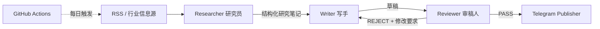

# Daily Chip News

**简体中文** | [English](README.en.md)

> 一个面向半导体销售、解决方案与业务岗位的 AI 行业情报自动化工作流。通过三节点 Micro-Graph，把“信息检索 → 内容生产 → 质量审核 → 自动发布”拆成可检查、可返工的闭环。

Daily Chip News 来自一个真实的信息处理场景：半导体相关岗位需要长期关注晶圆厂、芯片原厂、存储行情、供应链变化与 B2B 硬件趋势，但真正有价值的信息往往分散在多个来源，并混杂着大量低相关内容。

项目使用一个刻意保持轻量的三节点工作流：

**Researcher 研究员 → Writer 写手 → Reviewer 审稿人 → Publisher 发布**

其中 Publisher 是确定性发布层，不作为 Agent 节点。

截至 2026 年 8 月，仓库在 GitHub Actions 中累计记录 **230+ 次定时任务运行**，用于持续验证这类 AI 内容自动化流程，而不是一次性的 API Demo。

## 工作流



三个节点职责严格分离：

- **Researcher / 研究员**：抓取正文、判断商业/技术价值，只输出带来源的结构化研究笔记，不写最终稿。
- **Writer / 写手**：使用全新、干净的上下文，只接收 Editorial Brief、Research Notes 与必要的 Revision Brief，然后生成草稿。
- **Reviewer / 审稿人**：按照显式 Rubric 检查事实支撑、相关性、清晰度、时效性、重复、语气、长度和格式；不直接改稿。

审稿不通过时，Reviewer 只返回结构化问题与修改要求，再由 Writer 重新生成。返工次数默认最多 2 次；超过上限后内容进入 HOLD，不自动发布。

## 为什么采用三节点 Micro-Graph

单次 LLM 调用很容易把“找资料、写内容、检查内容”混在同一个上下文里。这个项目把三个职责拆开，主要解决三个问题：

1. **证据与成稿隔离**：Researcher 只传结构化笔记，Writer 不接触原始浏览轨迹和冗长网页上下文。
2. **干净上下文写作**：Writer 每次基于明确 Brief 与研究笔记生成，减少历史上下文污染。
3. **显式质量门**：任何内容只有在 Reviewer 返回 PASS 后才允许进入 Telegram 发布层。

重点是 **context isolation（上下文隔离）+ structured handoff（结构化交接）+ QA gate（质量门）**，而不是堆叠更多 Agent。

## 节点数据契约

### Researcher 输出

```json
{
  "decision": "KEEP",
  "topic": "HBM supply",
  "source": "SemiEngineering",
  "url": "https://example.com/article",
  "published_at": "2026-08-24",
  "notes": [
    {
      "claim": "可由原文直接支持的事实",
      "evidence": "证据摘要",
      "why_it_matters": "对半导体业务读者的意义",
      "confidence": 0.92
    }
  ]
}
```

### Writer 输出

```json
{
  "headline": "...",
  "summary": "...",
  "key_facts": ["...", "..."],
  "why_it_matters": "...",
  "telegram_copy": "..."
}
```

### Reviewer 输出

```json
{
  "status": "REJECT",
  "scores": {
    "factuality": 9,
    "relevance": 8,
    "clarity": 8
  },
  "issues": [
    {
      "severity": "major",
      "problem": "某项结论缺少 Research Notes 支撑"
    }
  ],
  "revision_brief": [
    "删除未经证据支持的结论"
  ]
}
```

## 内容来源与关注范围

默认信息源包括：

- EE Times
- Semiconductor Engineering
- ServeTheHome
- TrendForce
- Hacker News 高分技术条目

重点关注：

- 晶圆厂扩产与制程节点进展
- 主要芯片厂商新品与财报
- 存储、HBM 与服务器硬件
- 供应链涨价、缺货与库存变化
- CXL、RISC-V 等 B2B 硬件技术趋势
- AI 基础设施相关半导体信息

网页正文通过 Jina Reader 做清洗后进入 Researcher。

## 技术栈

| 环节 | 工具 |
| --- | --- |
| 信息采集 | RSS / `feedparser` |
| 正文提取 | Jina Reader |
| AI 节点 | Gemini API |
| Graph 编排 | Python 显式 Micro-Graph |
| 质量控制 | Reviewer Rubric + bounded rewrite loop |
| 内容推送 | Telegram Bot API |
| 定时调度 | GitHub Actions |
| 运行环境 | Python 3.11 |

## 仓库结构

```text
.
├── .github/
│   └── workflows/
│       └── daily_news.yml     # 每日自动运行
├── docs/
│   └── architecture.md        # V2 架构、状态与数据契约
├── .env.example               # 环境变量示例
├── .gitignore
├── main.py                    # 三节点 Micro-Graph 主流程
├── requirements.txt
├── README.md                  # 简体中文（默认）
└── README.en.md               # English
```

## 本地运行

安装依赖：

```bash
pip install -r requirements.txt
```

配置环境变量：

```bash
GEMINI_API_KEY=...
GEMINI_MODEL=gemini-3.5-flash-lite
TELEGRAM_BOT_TOKEN=...
TELEGRAM_CHAT_ID=...
ARTICLES_PER_FEED=2
MAX_REVISIONS=2
```

运行：

```bash
python main.py
```

不要把真实 API Key 或 Telegram 凭证提交到仓库。

## 自动化执行

GitHub Actions 每天自动触发一次，也支持手动运行。凭证通过 GitHub Actions Secrets 注入。

运行日志会区分：

- Researcher 主动 `SKIP`
- Reviewer `PASS`
- Reviewer `REJECT` 后返工
- 达到返工上限后的 `HOLD`
- Gemini / Jina / Telegram 等基础设施错误

因此“内容不值得发布”和“系统运行失败”不会被混为同一种结果。

## 设计原则

这个项目不追求大型多 Agent 架构，也不引入数据库、向量库或复杂编排平台。它只保留完成内容自动化闭环所需的最小结构：

**研究 → 写作 → 审核 → 发布**

更详细的节点职责、状态流转与数据契约见 [`docs/architecture.md`](docs/architecture.md)。
