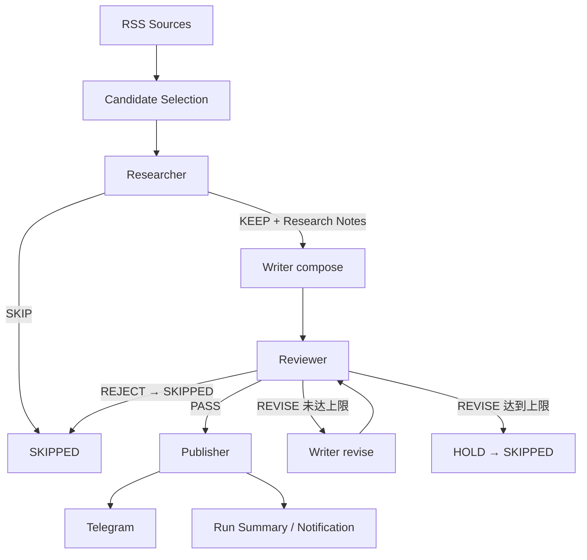

# Daily Chip News

**简体中文** | [English](README.en.md)

Daily Chip News 是一个每日运行的半导体行业情报自动化工作流。

它从多个行业 RSS 获取最新内容，用确定性代码完成正文提取、清洗与候选控制，再交给三个职责独立的 AI 节点处理：

**Sources → Candidate Selection → Researcher → Writer → Reviewer → Publisher → Run Summary**

Researcher 读取正文并输出结构化研究笔记；Writer 只根据研究笔记写中文成稿；Reviewer 按固定标准审核；审核通过后由确定性的 Publisher 推送至 Telegram；最后输出 run summary 与必要的运维告警。

## Pipeline



LangGraph `StateGraph` 编排三个 AI 节点，Publisher 保持确定性。默认最多返工一次（`MAX_REVISIONS=1`），达到上限进入 `HOLD`（计入 SKIPPED）。

## 三个 AI 节点

### Researcher

唯一读取文章正文的 AI 节点，正文输入上限 `ARTICLE_CONTENT_CHARS=12000`。它依据 editorial scope 判断相关性（`KEEP`/`SKIP`），并输出结构化 Research Notes：topic、来源、链接、日期、公司/产品/型号/事件、关键数字与时间、信息缺口（gaps），以及 1-4 条带证据与置信度的事实笔记。Research Notes 是后续写作与审核的**事实基线**。

### Writer

compose 只读取 Research Notes + editorial brief + 输出 schema，看不到正文、不能访问原网页、不得补充笔记之外的事实。revise 时额外接收 `previous_draft` 与 `revision_brief`，仍然使用同一套 Research Notes，不重新调用 Researcher，不改变事实来源。

### Reviewer

只读取 Research Notes + Draft + rubric，只审核不重写，重点检查事实一致性、公司名/产品名/型号/数字准确性、无依据扩写、文章结构与发布质量：

- `PASS`：达到发布质量，交给 Publisher。
- `REVISE`：可通过修改 draft 修好，必须给出明确的 `revision_brief`，触发一次 Writer 返工。
- `REJECT`：无法通过改写修复，候选以 `SKIPPED` 结束。

## 信息来源与候选控制

当前默认从五类来源收集候选文章（可用 `SOURCE_FEEDS` 覆盖）：

- [EE Times](https://www.eetimes.com/feed/)
- [Semiconductor Engineering](https://semiengineering.com/feed/)
- [ServeTheHome](https://www.servethehome.com/feed/)
- [TrendForce Semiconductors](https://www.trendforce.com/feed/Semiconductors.html)
- [Hacker News RSS](https://hnrss.org/newest?points=100)

候选选择完全由确定性代码完成（0 次模型调用）：

```text
RSS ingestion → normalize → canonical URL → dedupe → garbage filtering
→ recency filtering (MAX_CANDIDATE_AGE_HOURS) → source round-robin
→ MAX_CANDIDATES_PER_RUN (默认 6)
```

Candidate 统一为结构化对象：`id` / `title` / `url` / `source` / `published_at` / `metadata`。正文提取后由 `clean_extracted_text()` 去掉 reader 元数据、图片/分隔线、重复行，并按 `ARTICLE_CONTENT_CHARS` 截断。单个 RSS 不可用只影响该来源；所有来源均不可用时本次运行 `FAILED`。

## Gemini Client 与模型路由

所有 AI 节点共用同一个 Gemini client（`gemini.py`）：从配置读取 API Key、序列化请求、解析响应、超时、retry、HTTP 错误映射、JSON repair。每个节点独立配置模型与生成参数：

| 节点 | 变量 | 默认 thinking | 默认输出上限 |
| --- | --- | --- | --- |
| Researcher | `RESEARCHER_MODEL` | `low` | 3072 |
| Writer | `WRITER_MODEL` | `low` | 2560 |
| Reviewer | `REVIEWER_MODEL` | `low` | 1024 |

结构化输出保留 `responseSchema`（`GEMINI_STRUCTURED_OUTPUT=1`），不使用 Search grounding 等付费工具。所有配置项集中在 `config.py`，本地读取 `.env`，GitHub Actions 读取 Secrets / Variables。

## 可靠性

```text
TRANSIENT_RATE_LIMIT / TRANSIENT_SERVER / TRANSIENT_NETWORK   服务级，计入熔断
MODEL_RESPONSE_INVALID / MODEL_RESPONSE_TRUNCATED / SCHEMA_INVALID   候选级
SOURCE_ERROR / PUBLISH_ERROR / CONFIG_ERROR / UNEXPECTED_ERROR
```

- **retry**：429 优先遵守 `Retry-After`（上限 120s）；5xx / network / timeout 指数退避 2s→4s→8s→16s + jitter；单次逻辑调用受 `GEMINI_CALL_BUDGET_SECONDS=240` 约束，整场受 `RUN_BUDGET_SECONDS=2100` 约束，HTTP timeout 被 clamp 到剩余预算。
- **breaker**：最近 `BREAKER_WINDOW(5)` 个 AI 逻辑调用中，瞬态失败达到 `BREAKER_THRESHOLD(3)` 即判定服务不可用，终止本轮后续候选的 AI processing。粒度固定为 **1 个 logical call = 1 个事件**；`SchemaError`/`GeminiResponseError` 占位但不计瞬态，也不清空历史。
- **JSON repair**：非法结构化输出会走一次正常的模型调用修复，与主调用共享 deadline、retry 与超时预算。
- 模型 400 明确拒绝 `thinkingConfig` 时，本次运行自动降级为模型默认值并记录 `thinking_downgrades`。

## 运行结果

候选级状态只有三种：`PUBLISHED` / `SKIPPED` / `FAILED`（`SKIPPED` 含 researcher-skip、reviewer-reject、revision-limit）。

| Run outcome | 触发条件 | exit code |
| --- | --- | --- |
| `SUCCESS` | 无候选失败，且未因 breaker / 时间预算提前停止 | 0 |
| `PARTIAL_SUCCESS` | 有失败或提前停止，但至少发布了一条 | 0 |
| `FAILED` | 未发布任何内容且存在失败 / 提前停止；或程序级故障 | 1 |

已发布内容不会因为后续候选失败把 run 重新定义为 `FAILED`；全部候选被编辑规则跳过（`published == 0` 且无失败）视为正常完成。

## 可观测性

按候选记录：`id`、`source`、当前节点、revision、终态与错误分类。运行结束输出 `Run summary`：discovered / selected / processed / published / skipped（按原因细分）/ failed / revisions / breaker 状态 / 三个模型名 / final outcome，以及 Gemini 层面的 requests / retries / transient failures / JSON repair / thinking downgrades。设置 `RUN_SUMMARY_PATH` 时可额外写出 JSON summary 作为业务 artifact。

## 安装与配置

```bash
python -m venv .venv
.venv\Scripts\activate
python -m pip install -r requirements.txt
```

复制 `.env.example` 为 `.env` 并填写：

```env
GEMINI_API_KEY=your_gemini_api_key
RESEARCHER_MODEL=your_researcher_model
WRITER_MODEL=your_writer_model
REVIEWER_MODEL=your_reviewer_model
TELEGRAM_BOT_TOKEN=your_telegram_bot_token
TELEGRAM_CHAT_ID=your_telegram_chat_id
ARTICLES_PER_FEED=2
MAX_CANDIDATES_PER_RUN=6
MAX_REVISIONS=1
```

`.env` 已由 Git 忽略；Gemini key 通过 `x-goog-api-key` header 发送，日志与 summary 只输出安全字段。GitHub Actions 的凭证来自 Repository Secrets，模型名来自 Repository Variables。

## GitHub Actions

每天北京时间 06:55（`55 22 * * *` UTC）运行，也支持 `workflow_dispatch`，两者使用同一套 application architecture。

```text
checkout → setup python → install → run application（Secrets / Variables）
→ upload run summary artifact → notification（app 内 Telegram）
```

## 本地运行

```bash
python main.py
```

`PUBLISH_ENABLED=0` 可做不发送 Telegram 的 dry-run；`MAX_CANDIDATES_PER_RUN=1` 可做单候选 smoke。

## 单篇调用次数

```text
典型（KEEP → PASS）：Researcher 1 + Writer 1 + Reviewer 1 = 3 次
一次返工：            + Writer 1 + Reviewer 1            = 5 次
SKIP / REJECT：       仅到终止节点为止
JSON repair：         仅输出非法时 +1 次
```

## 测试

```bash
python -m compileall src tests main.py
python -m unittest discover -s tests -t tests
python -m ruff check .
```

测试按 pipeline 阶段组织：`test_sources`（canonical dedupe / garbage / recency / round-robin / limit）、`test_researcher`、`test_writer`、`test_reviewer`、`test_graph`（publish / skip / revision / revision limit / node failure）、`test_gemini`、`test_breaker`、`test_runner`（SUCCESS / PARTIAL_SUCCESS / FAILED）、`test_smoke_pipeline`（全 HTTP mock 的端到端 smoke）。

## 项目结构

```text
.
├─ src/daily_chip_news/
│  ├─ config.py       # 统一配置入口：模型 profile、source、retry、发布、通知
│  ├─ sources.py      # RSS 收集、canonical/dedupe/junk/recency/round-robin/limit
│  ├─ schemas.py      # Candidate / ResearchNotes / Draft / Review / GraphState
│  ├─ gemini.py       # 统一 Gemini client：序列化、retry、解析、JSON repair
│  ├─ nodes/
│  │  ├─ researcher.py
│  │  ├─ writer.py
│  │  └─ reviewer.py
│  ├─ graph.py        # LangGraph StateGraph 与 revision loop
│  ├─ health.py       # breaker
│  ├─ errors.py       # 错误分类与 routing flags
│  ├─ metrics.py      # run 级计数器
│  ├─ outcomes.py     # 候选/运行结果状态机与 exit code
│  ├─ publisher.py    # 确定性 Telegram 发布与运维告警
│  └─ runner.py       # 候选循环、run summary、通知
├─ tests/
├─ docs/architecture.md
├─ .github/workflows/daily_news.yml
├─ .env.example
├─ main.py
└─ requirements.txt
```

状态、数据契约与运行路径详见 [`docs/architecture.md`](docs/architecture.md)。
