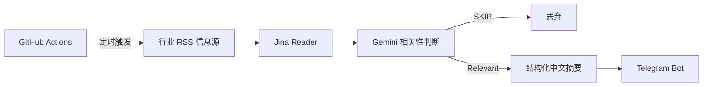
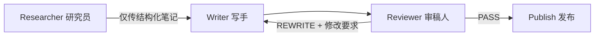

# Daily Chip News

[English](README.md) | [简体中文](README.zh-CN.md)

> 一个面向半导体销售及业务岗位的 AI 行业情报自动化工作流，将分散的行业资讯整理为更聚焦的每日简报。

Daily Chip News 起源于一个实际问题：半导体销售需要持续关注晶圆厂、芯片原厂、存储行情、供应链变化以及 B2B 硬件趋势，但真正有价值的信息往往淹没在大量低相关内容中。

这个项目主要把其中重复、机械的部分自动化：

**采集 → 提取 → 筛选 → 摘要 → 推送**

项目本身刻意保持轻量。目标并不是做一个通用新闻平台，而是验证 AI 如何替代重复的信息筛选工作，同时把内容判断标准保持为显式、可检查的规则。

## 项目功能

- 从选定的半导体与硬件 RSS 信息源抓取近期文章。
- 使用 Jina Reader 将网页正文转换为更适合后续处理的干净文本。
- 使用 Gemini 判断每篇文章对于半导体销售场景是否具有商业或技术价值。
- 对通过筛选的内容生成简短中文摘要，提取核心事件与关键数据。
- 通过 Telegram Bot 推送符合条件的内容。
- 使用 GitHub Actions 每日定时自动运行。

## 当前工作流 — V1



当前信息源覆盖方向包括：

- 半导体行业媒体
- 制程与制造相关资讯
- 企业级与服务器硬件
- 市场与供应链趋势
- 部分更广泛的技术趋势信号

筛选 Prompt 会优先关注晶圆厂扩产、制程节点进展、主要芯片厂商新品与财报、供应链涨价或缺货，以及 HBM、CXL、RISC-V 等 B2B 硬件技术趋势。

## 为什么做这个项目

这个项目真正有价值的部分，不是“做了一个会总结新闻的 Bot”，而是围绕真实信息任务设计了一条自动化工作流：

1. 先定义什么信息对于特定业务岗位才算有价值。
2. 在内容进入大模型前先尽量减少噪声。
3. 限制 AI 输出长度和结构，避免无效长文。
4. 把推送自动化，不依赖人工每天重复发起 Prompt。
5. 在长期运行中观察单模型链路的不足，并为下一版引入显式质量控制。

截至 2026 年 8 月，该仓库在 GitHub Actions 中已经累计产生 **230+ 次定时工作流运行记录**。它更接近一个持续运行的真实自动化实验，而不是一次性的 API Demo。

## 技术栈

| 环节 | 工具 |
| --- | --- |
| 信息采集 | RSS / `feedparser` |
| 正文提取 | Jina Reader |
| AI 处理 | Gemini API |
| 内容推送 | Telegram Bot API |
| 定时调度 | GitHub Actions |
| 运行环境 | Python 3 |

## 仓库结构

```text
.
├── .github/
│   └── workflows/
│       └── daily_news.yml     # 定时执行配置
├── docs/
│   └── architecture.md        # 当前架构与 V2 Micro-Graph 设计
├── .env.example               # 环境变量示例
├── .gitignore
├── main.py                    # 当前 V1 主流程
├── requirements.txt
├── README.md                  # English
└── README.zh-CN.md            # 简体中文
```

## 本地运行

1. 安装依赖：

```bash
pip install -r requirements.txt
```

2. 参考 `.env.example` 配置环境变量：

```bash
GEMINI_API_KEY=...
TELEGRAM_BOT_TOKEN=...
TELEGRAM_CHAT_ID=...
GEMINI_MODEL=gemini-3.5-flash-lite
```

3. 运行：

```bash
python main.py
```

不要把真实 API Key 或 Telegram 凭证提交到仓库。

## 自动化执行

GitHub Actions 默认每天运行一次，也支持在 Actions 页面手动触发。Gemini 和 Telegram 的凭证通过 GitHub Actions Secrets 注入。

当前维护重点之一，是让 API 或运行错误显式失败，而不是把基础设施异常静默当作内容层面的 `SKIP` 处理。

## V2 方向：三节点内容生产 Micro-Graph

下一版仍然保持小图，不扩成复杂多 Agent 系统：



三个节点职责明确隔离：

- **Researcher / 研究员**：负责检索、提取与整理证据，不直接写最终成稿。
- **Writer / 写手**：使用全新、干净的上下文，只接收内容 Brief 与结构化研究笔记，然后完成草稿。
- **Reviewer / 审稿人**：根据显式 Rubric 检查事实支撑、相关性、清晰度、重复、时效性、语气和格式。

如果审稿不通过，只返回简洁的修改要求给 Writer。返工次数设置上限，避免无控制的循环。

这个设计重点是 **context isolation（上下文隔离）+ QA gate（质量门）**，而不是为了展示而堆叠 Agent。更详细的数据契约和审核循环设计见 [`docs/architecture.md`](docs/architecture.md)。

## 当前限制

V1 仍然是一个刻意保持简单的版本，目前已知限制包括：

- 核心逻辑仍然集中在一个脚本中。
- 相关性判断和摘要目前由同一个模型完成。
- 文章去重与每日 Digest 聚合能力有限。
- 运行可观测性仍比较基础。
- V2 的 Researcher → Writer → Reviewer Graph 目前仍属于规划中的升级，**尚未作为已完成功能进行包装**。

这些限制会明确保留在仓库文档中，确保项目展示和真实完成状态一致，而不是把原型包装成已经完成的生产系统。
