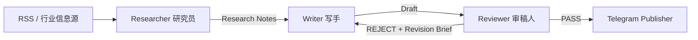

# Daily Chip News V2 架构

Daily Chip News V2 使用一个三节点内容生产 Micro-Graph：



Publisher 是确定性基础设施，不作为 Agent 节点。

## 1. 设计目标

架构围绕三条原则：

- **角色隔离**：检索、写作、审稿不混在同一个 Prompt 中。
- **上下文隔离**：Writer 只接收经过筛选的结构化研究笔记，不继承网页正文和 Researcher 的处理上下文。
- **显式 QA Gate**：只有 Reviewer 返回 `PASS` 的内容才允许进入发布层。

整个图保持小型、可观察、可调试，不引入数据库、向量库或复杂多 Agent 基础设施。

## 2. Researcher / 研究员

Researcher 负责：

1. 使用 Jina Reader 提取文章正文；
2. 判断文章是否具有半导体商业或技术价值；
3. 只提取原文可以支持的事实；
4. 将事实整理为结构化 Research Notes。

它不写最终文案。

输出契约：

```json
{
  "decision": "KEEP",
  "reason": "与 HBM 供应链相关",
  "topic": "HBM supply",
  "source": "SemiEngineering",
  "url": "https://example.com/article",
  "published_at": "2026-08-24",
  "notes": [
    {
      "claim": "可由原文直接支持的事实",
      "evidence": "证据摘要",
      "why_it_matters": "对半导体业务读者的意义",
      "confidence": 0.92
    }
  ]
}
```

`decision=SKIP` 时不会进入 Writer。

## 3. Writer / 写手

Writer 每次从干净上下文开始，只接收：

- Editorial Brief；
- Research Notes；
- 必要时的 Revision Brief。

不会向 Writer 传递：

- 原始网页正文；
- RSS 抓取过程；
- Researcher 的提示词或中间处理上下文；
- Reviewer 的长篇解释。

输出契约：

```json
{
  "headline": "...",
  "summary": "...",
  "key_facts": ["...", "..."],
  "why_it_matters": "...",
  "telegram_copy": "..."
}
```

Writer 被明确要求不得补充 Research Notes 中不存在的事实、数字、因果或预测。

## 4. Reviewer / 审稿人

Reviewer 是质量门，不是第二个 Writer。

审核维度：

- factual grounding
- source coverage
- unsupported claims
- recency
- commercial relevance
- clarity
- duplication
- tone
- length
- output formatting

输出契约：

```json
{
  "status": "REJECT",
  "scores": {
    "factuality": 9,
    "relevance": 8,
    "clarity": 8
  },
  "issues": [
    {
      "severity": "major",
      "problem": "某项结论缺少 Research Notes 支撑"
    }
  ],
  "revision_brief": [
    "删除未经证据支持的结论"
  ]
}
```

以下情况必须 `REJECT`：

- `factuality < 8`
- `relevance < 8`
- 出现 major issue
- 草稿包含研究笔记无法支持的事实或数字

Reviewer 不直接改写正文。

## 5. 有界返工循环

```text
Researcher
   ↓
Writer
   ↓
Reviewer ── PASS ──> Publish
   │
 REJECT
   │
   └───────────────> Writer
        max 2 revisions
```

默认最多返工 2 次。

如果达到上限仍未通过，状态进入 `HOLD`，内容不会自动发布。

## 6. Graph State

单篇文章的最小状态可以表示为：

```json
{
  "article": {},
  "research": {},
  "draft": {},
  "review": {},
  "revision_count": 0,
  "status": "PASS"
}
```

主流程只需要判断四类内容状态：

- `SKIP`：Researcher 判定无发布价值
- `PASS`：Reviewer 验收通过
- `REJECT`：进入返工
- `HOLD`：超过返工上限，不发布

Gemini、Jina、Telegram 等基础设施错误通过异常显式暴露，不会伪装成 `SKIP`。

## 7. Publisher / 发布层

Publisher 不调用 LLM，只做确定性操作：

1. 接收 Reviewer 已通过的 `telegram_copy`；
2. 附加原文链接；
3. 调用 Telegram Bot API 发布。

因此 AI 节点没有权限绕过 Reviewer 直接发布内容。

## 8. 调度与运行

GitHub Actions 每日触发一次主流程：

```text
GitHub Actions
      ↓
Collect RSS candidates
      ↓
Run Micro-Graph per article
      ↓
Publish only PASS items
      ↓
Print run statistics
```

运行统计包括：

- candidate 数量
- Researcher SKIP 数量
- Reviewer PASS 数量
- REJECT 后返工数量
- HOLD 数量
- 最终发布数量

## 9. 技术边界

V2 保持以下边界：

- Python 显式编排，不引入大型 Agent 框架；
- Gemini API 负责三个 AI 节点；
- RSS + Jina Reader 负责候选信息获取和正文提取；
- Telegram Bot API 负责发布；
- GitHub Actions 负责定时调度；
- 不使用数据库、向量库、RAG 或持久化 memory。

目标不是展示复杂度，而是展示一个完整、可解释、带质量门的 AI 内容自动化闭环。
