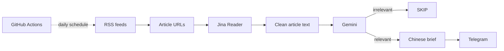
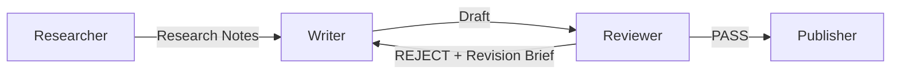

# Architecture

This document separates the **current V1 implementation** from the **planned V2 micro-graph**. The distinction is intentional: the repository should show what already works, what failed in long-running use, and what is being improved next.

## 1. V1 — current implementation

V1 is a linear content-automation pipeline:



### Responsibilities

| Stage | Responsibility |
| --- | --- |
| RSS collection | Pull a small set of recent articles from selected sources |
| Content extraction | Reduce web-page noise before LLM processing |
| Relevance filter | Decide whether an item matters to a semiconductor sales / business context |
| Summarization | Produce a compact Chinese brief with core intelligence and key data |
| Delivery | Push qualified items into Telegram |
| Scheduling | Run the pipeline automatically every day |

### What V1 proved

V1 proved that a small AI workflow can remove a meaningful amount of repetitive information triage without requiring a full content-management system.

It also exposed two weaknesses that matter in a long-running workflow:

1. **Quality control is implicit.** The same LLM call both judges relevance and produces the final content.
2. **Operational failures can look like editorial decisions.** If an API failure is converted into `SKIP`, the scheduler can remain green while content delivery silently stops.

Those observations are the main reason for V2.

---

## 2. V2 — planned three-node editorial micro-graph

V2 keeps the graph deliberately small:



The Publisher remains deterministic infrastructure rather than an agent node.

### Design goal

The graph is designed around three principles:

- **Role separation** — research, writing, and review should not collapse into one prompt.
- **Context isolation** — the Writer receives a clean context instead of raw browsing history.
- **Explicit QA** — publication requires a visible review decision against a defined rubric.

---

## 3. Node 1 — Researcher

The Researcher retrieves, extracts, and normalizes evidence. It does **not** write the final article.

### Input

```json
{
  "date": "2026-08-24",
  "topic_scope": [
    "semiconductors",
    "memory",
    "foundries",
    "AI infrastructure",
    "B2B hardware"
  ],
  "source_limit": 10
}
```

### Output contract

```json
{
  "topic": "HBM supply",
  "notes": [
    {
      "claim": "A source-supported factual statement",
      "evidence": "Relevant excerpt or normalized fact",
      "source": "Publisher name",
      "url": "https://example.com/article",
      "published_at": "2026-08-24",
      "why_it_matters": "Why this matters to a business-facing semiconductor reader",
      "confidence": 0.92
    }
  ]
}
```

Only structured notes move forward. Raw browsing context and long article bodies are not passed to the Writer.

---

## 4. Node 2 — Writer

The Writer starts from a fresh context containing only:

1. an editorial brief;
2. structured Research Notes;
3. the required output schema.

The Writer should not see the Researcher's browsing trace or hidden intermediate reasoning.

### Draft contract

```json
{
  "headline": "...",
  "summary": "...",
  "key_facts": ["...", "...", "..."],
  "why_it_matters": "...",
  "telegram_copy": "..."
}
```

The first V2 implementation should keep distribution narrow. Telegram remains the primary output; platform-specific content for X, TikTok, or YouTube should only be added if there is a real use case.

---

## 5. Node 3 — Reviewer

The Reviewer is a QA gate, not a second Writer.

### Review rubric

The reviewer checks:

- factual grounding;
- source coverage;
- unsupported claims;
- recency;
- commercial relevance;
- clarity;
- duplication;
- tone;
- length;
- output formatting.

### Review contract

```json
{
  "status": "REJECT",
  "scores": {
    "factuality": 9,
    "relevance": 7,
    "clarity": 8
  },
  "issues": [
    {
      "severity": "major",
      "problem": "A conclusion is not supported by the supplied Research Notes"
    }
  ],
  "revision_brief": [
    "Remove the unsupported market-share conclusion",
    "Explain the supply-chain impact more directly"
  ]
}
```

The Reviewer should not rewrite the content itself. On rejection, the Writer receives the original Research Notes plus the concise revision brief.

---

## 6. Revision loop

The rewrite loop is capped:

```text
Researcher
   ↓
Writer
   ↓
Reviewer ── PASS ──> Publish
   │
 REJECT
   │
   └───────────────> Writer
        max 2 revisions
```

If the maximum number of revisions is reached, the item should be held instead of being published automatically.

---

## 7. Operational state

A minimal graph state can remain small:

```json
{
  "research_notes": {},
  "draft": {},
  "review": {},
  "revision_count": 0,
  "publish_status": "pending"
}
```

The project does not need a database, vector store, or large orchestration layer for the first V2 iteration.

---

## 8. Acceptance criteria for V2

V2 is complete only when all of the following are true:

- Researcher output is structured and source-linked.
- Writer receives a clean, intentionally limited context.
- Reviewer can return both PASS and REJECT through machine-readable output.
- A rejected draft can return to Writer with a revision brief.
- Rewrite attempts are capped.
- A model/API failure is distinguishable from an editorial `SKIP` decision.
- Scheduled execution reports a visible failure when the AI stage is unavailable.
- Telegram publishing occurs only after Reviewer PASS.

The objective is a small, inspectable workflow that demonstrates content automation, context design, and QA—not a large multi-agent architecture.
